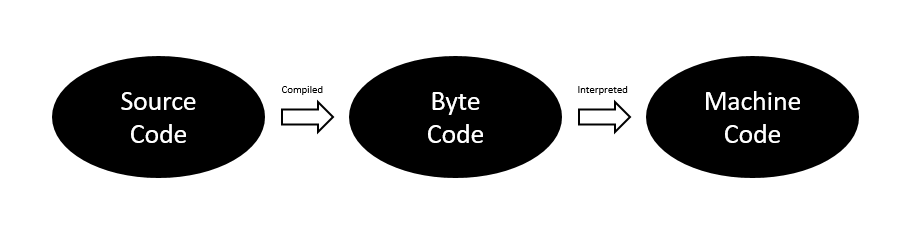
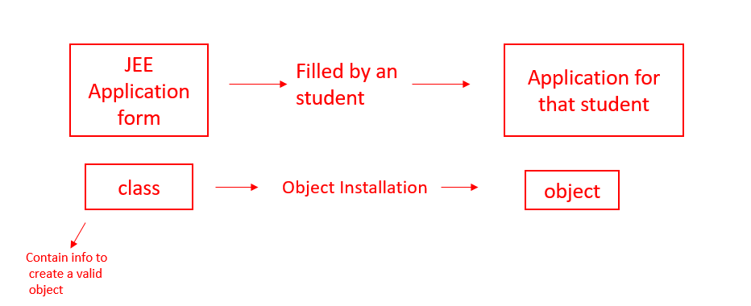

<!--
author:   Aldrin Muramba
email:    amuramba@ceic.uz.ac.zw
version:  0.0.1
language: en
narrator: US English Female
comment:  Programming II is an object oriented programming course based on Java programming language. It covers the basics of programming in Java and extends to object oriented principles.
-->

# Programming II (in Java)

------------------------------------

Contents
================================================

1. Java installation
2. Variables and data types
3. Operators and expressions
4. Strings
5. Conditional Statements
6. Loops
7. Arrays
8. Introduction to OOP
9. Constructors
10. Interfaces and Abstract Classes
11. Inheritance
12. Exception Handling
13. Multithreading


## Java Installation
- Java is one of the most popular programming languages because it is used in various tech fields like app development, web development, client-server applications, etc.
- Java is an object-oriented programming language developed by Sun Microsystems of the USA in 1991.
- It was originally called Oak by James Goslin. He was one of the inventors of Java.
- Java = Purely Object-Oriented.

How Java Works?
================================================
- The source code in Java is first compiled into the bytecode.
- Then the Java Virtual Machine(JVM) compiles the bytecode to the machine code.



#### Downloading and Installing JDK 
Downloading JDK
--------------------------------
- JDK stands for Java Development Kit. It contains Java Virtual Machine(JVM) and Java Runtime Environment(JRE).
- JDK – Java Development Kit = Collection of tools used for developing and running java programs.
- JRE – Java Runtime Environment = Helps in executing programs developed in JAVA.
- [Click here](https://www.oracle.com/java/technologies/javase-jdk16-downloads.html), and you will be redirected to the official download page of JDK. 
- Select your operating system and download the file(executable file in case of Windows).

Installing JDK
----------------------------------------------------------------
- Once the executable file is downloaded successfully, right-click and open the file.
- The executable file will start executing.
- Keep clicking on the Next button to install the JDK in default settings.

Downloading and Installing IntelliJ IDEA
================================================

- We need an Integrated Development Environment(IDE) to write and debug our code easily. IntelliJ IDEA is the best-suited for this.
- [Click here](https://www.jetbrains.com/idea/download/#section=windows), and you will be redirected to the official download page of IntelliJ IDEA.
- Download the Community Version of the IntelliJ IDEA as it is free to use.

Installing IntelliJ IDEA
--------------------------------
- Once the download completes, open the .exe file, and the installation process will begin.
- Click on the **"Next"** button to install the IntelliJ IDEA in the default location.
- Do not forget to check **"Add launchers dir to the PATH,"** as shown in the below image.


- After this, click on the "Next" button and then click on the **"Install"** button.


## Variables and data types
- Just like we have some rules that we follow to speak English (the grammar), we have some rules to follow while writing a Java program. This set of these rules is called syntax. It’s like Vocabulary and Grammar of Java.

Variables
================================================================
- A variable is a container that stores a value.
- This value can be changed during the execution of the program.
- Example: 

    `int number = 8;` 
    
-   Here, `int` is a data type, the `number` is the variable name, and `8` is the value it contains/stores.


Rules for declaring a variable name
----------------------------------------------------------------
- We can choose a name while declaring a Java variable if the following rules are followed:
- Must not begin with a digit. (E.g., 1arry is an invalid variable)
- Name is case sensitive. (Harry and harry are different)
- Should not be a keyword (like Void).
- White space is not allowed. (int Code With Harry is invalid)
- Can contain alphabets, $character, _character, and digits if the other conditions are met.

Data Types
================================================================
Data types in Java fall under the following categories
- Primitive Data Types (Intrinsic)
- Non-Primitive Data Types (Derived)

Primitive Data Types
----------------------------------------------------------------
- Java is statically typed, i.e., variables must be declared before use. Java supports 8 primitive data types:

| Data type | Value range | Size   | Default value |
|:----------|:------------|:-------|:--------------|
|byte | -128 to 127 |1 byte |0 |
|short | -(2^16^)/2 to (2^16^)/2 - 1 |2 bytes |0 |
|int | -(2^32^)/2 to (2^32^)/2 - 1 |4 bytes |0 |
|float | 3.4e-038 to 3.4e+038  |4 byte  |0.0f |
|long | -(2^64^)/2 to (2^64^)/2 - 1 |8 bytes |0 |
|double | 1.7e-308 to 1.7e+308 |8 byte  |0 .0d |
|char | 0 to 65535 (2^16^ - 1) |2 bytes -> as it supports unicode  |'100000'  |
|boolean | true or false |depends on JVM  |false |

How to choose data types for our variables
---------------------------------------------------
- In order to choose the data type, we first need to find the type of data we want to store. 
- After that, we need to analyze the min & max value we might use, e.g if we are capturing student marks out of 100, `byte` is sufficient

### Literals
A constant value which can be assigned to a variable is called as a literal.

- 101     ->  iteger literal
- 10.1f   ->  float literal
- 10.1    ->  double literal
- 'A'     ->  character literal
- true    ->  boolean literal
- 'Joe'   ->  string literal

```Java  +Literals.java
package com.company;

public class Literals {
    public static void main(String[] args) {
        byte age = 34;
        int age2 = 56;
        short age3 = 87;
        long ageDino = 5666666666666L;
        char ch = 'A';
        float f1 = 5.6f;
        double d1 = 4.66;
        boolean a = true;
        
        System.out.print(age);
        
        String str = "Joe";        
        System.out.println(str);
    }
}
```

Keywords
================================================================
Here is a list of keywords in the Java programming language. You cannot use any of the following as identifiers in your programs. The keywords _const_ and _goto_ are reserved, even though they are not currently used. true, false, and null might seem like keywords, but they are actually literals; you cannot use them as identifiers in your programs.

- Words which are reserved and used by the Java compiler.
    For a comprehensive list of keywords, see the list from Oracle documentation : [Click here](https://docs.oracle.com/javase/tutorial/java/nutsandbolts/_keywords.html)
| | | | | |
|:----:|:----:|:----:|:----:|:----:|
|abstract|continue|for|new|switch|
|assert***|default|goto*|package|synchronized|
|boolean|do|if|private|this|
|break|double|implements|protected|throw|
|byte|else|import|public|throws|
|case|enum****|instanceof|return|transient|
|catch|extends|int|short|try|
|char|final|interface|static|void|
|class|finally|long|strictfp**|volatile|
|const*|float|native|super|while|

### Reading data from the  keyboard
- In order to read data from the keyboard, Java has a Scanner class found in the java.util package. 
- The Scanner class has many methods for taking input from the user depending upon the type of input. 
- To use any of the methods of the Scanner class, first, we need to create an object of the Scanner class as shown in the below example:

```
import java.util.Scanner;  // Importing  the Scanner class
Scanner sc = new Scanner(System.in);  //Creating an object named "sc" of the Scanner class.
```

- Taking an integer input from the keyboard :

```
Scanner sc = new Scanner(System.in);  //(Read from the keyboard)
int a = sc.nextInt();  //(Method to read from the keyboard)
```

Example 1
================================================================
```Java -TakingInput.java
package com.company;
import java.util.Scanner;

public class TakingInput {
    public static void main(String[] args) {
        System.out.println("Taking Input From the User");
        Scanner sc = new Scanner(System.in);
        System.out.println("Enter number 1");
        float a = sc.nextFloat();
        System.out.println("Enter number 2");
        float b = sc.nextFloat();

        float sum = a + b;
        System.out.print("The sum of these float numbers is ");
        System.out.println(sum);

        boolean b1 = sc.hasNextInt();
        System.out.println(b1);
//        String str = sc.next();
        String str = sc.nextLine();
        System.out.println(str);

    }
}
```

Example 2
================================================================
1. Write a program to sum three numbers in Java.
```Java -Total.java
package com.company;
import java.util.Scanner;

public class Total {
    public static void main(String args[]) {
        Scanner s = new Scanner(System.in);
        System.out.print("Enter value of x : ");
        int x = s.nextInt();  // method to read integer from the keyboard
        System.out.print("Enter value of y : ");
        int y = s.nextInt();
        System.out.print("Enter value of z : ");
        int z = s.nextInt();
        int sum=x+y+z;
        System.out.println("Sum of x + y + z = " + sum);
    }
}
```

#### Exercises

1. Write a Program to calculate the average percentage score of a given student doing 5 subjects/courses. His/her marks must be taken as input from the keyboard
2. Write a Java program that asks the user to enter his/her name and greets them with “Hello <name>, have a good day” text.
3. Write a Java program to convert Kilometers to miles.
4. Write a Java program to detect whether a number entered by the user is an integer or not.


## Operators & Expressions
- An operator is a symbol that the compiler to perform a specific operation on operands.
- Example :  `a + b = c`
- In the above example, `a` and `b` are operands on which the `+` operator is applied.

Types of operators
================================================================

1. Arithmetic Operators
----------------------------------------------------------------
- Arithmetic operators are used to perform mathematical operations such as addition, division, etc on expressions.
- Arithmetic operators cannot work with Booleans.
- % operator can work on floats and doubles.
- Let `x = 7` and `y = 2`

|Operator |Description|Example|
|:--|:--|:--|
|+ (addition)|Used to add two numbers|x + y = 9|
|- (subtraction)|Used to subtract right-hand value from left-hand value|x - y = 5 |
|* (multiplication)|Used to multiply two numbers|x * y = 14|
|/ (division)|Used to divide left-hand value by right-hand value|x / y = 3 |
|% (modulus)|Gives the remainder after dividing left-hand value by right-hand value|x % y = 1 |
|++ (increment)|Increases the value of the operand by 1|y++ = 3|
|-- (decrement)|Decreases the value of the operand by 1|x++ = 6|

2. Comparison Operators :
----------------------------------------------------------------
- As the name suggests, these operators are used to compare two operands and returns a boolean value.
- Let `x = 7` and `y = 2`
|Operator |Description|Example|
|:--|:--|:--|
|== (equal) | Checks if two operands are equal. | x == y -> False|
|!= (not equal) | Checks if two operands are not equal. | x != y -> True|
|> (greater than) | Checks if left-hand value is greater than right-hand value. | x > y -> True|
|< (less than) | Checks if left-hand value is less than right-hand value. | x < y -> False|
|>= (greater than) | Checks if left-hand value is greater than or equal to right-hand value. | x >= y -> True|
|<= (less than) | Checks if left-hand value is less than pr equal to right-hand value. | x <= y -> False|

3. Logical Operators :
----------------------------------------------------------------
- These operators determine the logic in an expression containing two or more values or variables.
- Let `x = 8` and `y = 2`
|Operator |Description|Example|
|:--|:--|:--|
|&& (logical and) |Returns true if both operands are true |x < y && x != y -> True|
|\|\| (logical or) |Returns true if any of the operands is true |x < y || x == y -> True|
|! (logical not) |Returns true if the result of the expression is false and vice-versa |!(x < y || x == y) -> True|

4. Bitwise Operators :
---------------------------------------------------------------
- These operators perform the operations on every bit of a number.
- Let `A = 4` and `B = 3`. So __4__ in binary is __100__, and __3__ is __011__. 
|Operator |Description|Example|
|:--|:--|:--|
|& (bitwise and) |1 & 1 = 1, 1 & 0 = 0, 0 & 1 = 0, 0 & 0 = 0 | (A & B) = (100 & 011) = 000 |
| \|  (bitwise or) |1 \| 1 = 1, 1 \| 0 = 1, 0 \| 1 = 1, 0 \| 0 = 0 | (A \| B) = (100 \| 011) = 111 |
|^ (bitwise xor) |1 ^ 1 = 0, 1 ^ 0 = 1, 0 ^ 1 = 1, 0 ^ 0 = 0 | (A ^ B) = (100 ^ 011) = 111 |
|<< (left shift)|This operator moves the value left by the number of bits specified|13 << 2 = 52 (decimal) | 
|>> (right shift)|This operator moves the value right by the number of bits specified|13 >> 2 = 3 (decimal) |

### Precedence of operators
- The operators are applied and evaluated based on precedence. For example, `(+, -)` has less precedence compared to `(*, /)`. Hence `*` and `/` are evaluated first.
- In case we like to change this order, we use parenthesis `()`

Example

```Java +Operators.java
package com.company;

public class Operators {
    public static void main(String[] args) {
        // 1. Arithmetic Operators
        int x = 4;
        int y = 6 % a; // Modulo Operator
        float z = 4.8%1.1 //--> Returns Decimal Remainder

        // 2. Assignment Operators
        int b = 9;
        b *= 3;
        System.out.println(b);

        // 3. Comparison Operators
        System.out.println(64<6);

        // 4. Logical Operators
        System.out.println(64>5 && 64>98);
        System.out.println(64>5 || 64>98);

        // 5. Bitwise Operators
        System.out.println(2&3);
    }
}
```
### Associativity
- Associativity tells the direction of the execution of operators. It can either be left to right or vice versa.

- `/ *` -> Left to Right
- `+ -` -> Left to Right
- `++, =` -> Right to Left

- Here is the precedence and associativity table which makes it easy for you to understand these topics better:

|Precedence|Operator|Type|Associativity|
|--|--|--|--|
|15|()|Parentheses|Left to Right|
||[]|Array subscript||
||·|Member selection||
|14|++|Unary post-increment|Right to left|
||--|Unary post-decrement||
|13|++|Unary pre-increment|Right to left|
||--|Unary pre-decrement||
||+|Unary plus||
||-|Unary minus||
||!|Unary logical negation||
||~|Unary bitwise complement||
||(type)|Unary type cast||
|12|*|Multiplication|Left to right|
||/|Division||
||%|Modulus||
|11|+|Addition|Left to right|
||-|Subtraction||
|10|<<|Bitwise left shift|Left to right|
||>>|Bitwise right shift with sign extension||
||>>>|Bitwise right shift with zero extension||
|9|<|Relational less than|Left to right|
||<=|Relational less than or equal||
||>|Relational greater than||
||>=|Relational greater than or equal||
||instanceof|Type comparison (objects only)||
|8|==|Relational is equal to|Left to right|
||!=|Relational is not equal to||
|7|&|Bitwise AND|Left to right|
|6|^|Bitwise exclusive OR|Left to right|
|5|||Bitwise inclusive OR|Left to right|
|4|&&|Logical AND|Left to right|
|3||||Logical OR|Left to right|
|2|? :|Ternary conditional|Right to left|
|1|=|Assignment|Right to left|
||+=|Addition assignment||
||-=|Subtraction assignment||
||*=|Multiplication assignment||
||/=|Division assignment||
||%=|Modulus assignment||

Example
----------------------------------------------------------------
```Java +OperatorPrecedence.java
package com.company;

public class OperatorPrecedence {
    public static void main(String[] args) {
        int a = 6*5-34/2;
        /*
        Highest precedence goes to * and /. 
        They are then evaluated on the basis of left to right associativity
            =30-34/2
            =30-17
            =13
        */
        System.out.println(a);
        int b = 60/5-34*2;
        /*
            =12-34*2
            =12-68
            =-56
         */
        System.out.println(b);
    }
}
```
**Quick Quiz:** How will you write the following expressions in Java?


### Resulting data type after arithmetic operation

- Result = byte + short -> integer
- Result = short + integer -> integer
- Result = long + float -> float
- Result = integer + float -> float
- Result = character + integer -> integer
- Result = character + short -> integer
- Result = long + double -> double
- Result = float + double -> double

Example
--------------------------------------------------------
```Java +ResultingDataType.java
package com.company;

public class ResultingDataType {
    public static void main(String[] args) {
        byte x = 5;
        int y = 6;
        short z = 8;
        int a = y + z;
        float b = 6.54f + x;
        System.out.println(b);
    }
}
```
 
### Increment and Decrement operators
- `a++, ++a` (Increment Operators)
- `a--, --a` (Decrement Operators)
- These will operate on all data types except Booleans.

Example
--------------------------------------------------------
```Java +IncDecOperators.java
package com.company;

public class IncDecOperators {
    public static void main(String[] args) {
        int i = 56;
        // int b = i++; // first b is assigned i (56) then i is incremented
        int j = 67;
        int c = ++j; // first j is incremented then c is assigned j (68)
        System.out.println(i++);
        System.out.println(i);
        System.out.println(++i);
        System.out.println(i);
        int y = 7;
        System.out.println( ++y *8);
        char ch = 'a';
        System.out.println(++ch);
    }
}
```

**Quick Quiz: Try increment and decrement operators on a Java variable**

- a++ -> first use the value and then increment
- ++a -> first increment the value then use it

**Quick Quiz: What will be the value of the following expression(x)**

```
int y=7;
int x = ++y*8;
value of x?
```
**Quick Quiz: What will be the value of the following expression (a++)**

```
char a = ‘B’;
a++; (a is not ‘C’)
```

Q1 - Solution
------------------------------------------------------------------------------------------------
- Write a program to calculate the percentage of a given student. His marks from 5 subjects must be taken as input from the keyboard. (Marks are out of 100)

Code Solution:
----------------------------------
```Java +Solution.java
package com.company;
import java.util.Scanner;

public class Solution {
    public static void main(String[] args) {
        Scanner scan = new Scanner(System.in);
        System.out.println("Enter your Physics marks : ");
        int phy = scan.nextInt();
        System.out.println("Enter your English marks : ");
        int eng = scan.nextInt();
        System.out.println("Enter your Chemistry marks : ");
        int chem = scan.nextInt();
        System.out.println("Enter your Mathematics marks : ");
        int math = scan.nextInt();
        System.out.println("Enter your Computer Science marks : ");
        int comp = scan.nextInt();

        float percentage = ((phy + eng + chem + math + comp)/500.0f)*100;

        System.out.println("percentage : ");
        System.out.println(percentage);
    }
}
```

#### Exercises

1. What will be the result of the following expression:

    `float a = 7/4 * 9/2`
2. Find the value of 'a' in expression given below :

    `int a = 7*49/7 + 35/7`
3. Write a java program to encrypt a grade by adding 8 to it. Decrypt it to show the correct grade.
4. Use comparison operators to find out whether a given number is greater than the user entered number or not.
5. Write the following expression in a java program, values for v, u, a and s must be inputed from keyboard:

    (v^2^-u^2^)/2as


## Strings

- A string is a sequence of characters.
- Strings are objects that represent a char array. For example :

```
char[] str = {'A','L','D','R','I','N'};
String s = new String(str);
```

is same as :

```java
String s = "ALDRIN";
```

- Strings are immutable and cannot be changed.
- java.lang.String class is used to create a String object.
- The string is a class but can be used as a data type.
- Syntax of strings in Java :

```java
String <String_name> = "<sequence_of_string>";
```

Example :

```java
 String str = "CodeWithMe";
```

- In the above example, str is a reference, and “CodeWithMe” is an object.

### Creating a string
In Java, strings can be created in two ways :
- By using string literal
- By using the new 

Creating String using String literal
------------------------------------------------
```Java
String s1 = "String literal";
```

- We use double quotes("") to create string using string literal. Before creating a new string instance, JVM verifies if the same string is already present in the string pool or not. 
- If it is already present, then JVM returns a reference to the pooled instance otherwise, a new string instance is created.

- In the above diagram, notice that string "Harry" is already present in the string pool, which is pointed by the str1. 
- When we try to create the same string object using str2, JVM finds that string object with the value "Harry" is already present in the string pool; therefore, instead of creating a new object, a reference to the same object is returned.

Creating String using new
-------------------------------------------------
```Java
String s = new String("Caramel");
```

When we create a string using "new", a new object is always created in the heap memory. See the examples given below to get a better understanding of String literal and String object :

```Java
String str1 = "Code With Me";
String str2 = "Code With Me";
System.out.println(str1 == str2); 
```

- Output = True

__*Returns true because str1 and str2 are referencing the same object present in the string constant pool.*__

Now, let's see the case of the String object :

```Java
String str1 = new String("Keep coding"); 
String str2 = new String("Keep coding"); 
System.out.println(str1 == str2); 
```

- Output = False

__*Although the value of both the string object is the same, still false is displayed as output because str1 and str2 are two different string objects created in the heap. That's why it is not considered a good practice two compare two strings using the == operator.*__

__NB: Always use the equals() method to compare two strings in Java.__

Print/Display
================================================================

We can use the following ways to print in Java:

- System.out.print() // No newline at the end
- System.out.println() // Prints a new line at the end
- System.out.printf()
- System.out.format()

The following formats can be associated with printf():

- %d for int
- %f for float
- %c for char
- %s for String

```Java
System.out.printf("%c",ch)
```

Example
------------------------------------------
```Java +MyStrings.java
package com.company;
import java.util.Scanner;

public class MyStrings {
    public static void main(String[] args) {
        String name = new String("Aldrin");
        String name = "Aldrin";
        System.out.print("My name is ");
        System.out.print(name);
        int a = 6;
        float b = 5.6454f;
        System.out.printf("The value of a is %d and value of b is %8.2f", a, b);
        
        System.out.format("The value of a is %d and value of b is %f", a, b);
        
        Scanner sc = new Scanner(System.in);
        String s = sc.next();
        String st = sc.nextLine();
        System.out.println(s + st);
    }
}
```
### String Methods

- String Methods operate on Java Strings. They can be used to find the length of the string, convert to lowercase, etc.
- Some of the commonly used String methods are:

```
String name = “Kishan”;
```
- (Indexes of the above string are as follows: 0-K, 1-i, 2-s, 3-h, 4-a, 5-n)

|  **Methods**  |  **Description**  |
|:--------------|:------------------|
|  **1. length()**  |  	Returns the length of String name. (6 in this case)  |
|  **2. toLowerCase()**  |  Converts all the characters of the string to the lower case letters.  |
|  **3. toUpperCase()**  |  Converts all the characters of the string to the upper case letters.  |
|  **4. trim()**  |  Returns a new String after removing all the leading and trailing spaces from the original string.  |
|  **5. substring(int start)**  |  Returns a substring from start to the end. Substring(3) returns “han”. [Note that indexing starts from 0]  |
|  **6. substring(int start, int end)**  |  Returns a substring from the start index to the end index. The start index is included, and the end is excluded.  |
|  **7. replace(‘K’, ‘p’)**  |  Returns a new string after replacing K with p. pishan is returned in this case. (This method takes char as argument)  |
|  **8. startsWith(“Ki”)**  |  Returns true if the name starts with the string “Ki”. (True in this case)  |
|  **9. endsWith(“an”)**  |  Returns true if the name ends with the string “an”. (True in this case)  |
|  **10. charAt(2)**  |  Returns the character at a given index position. (s in this case)  |
|  **11. indexOf(“s”)**  |  Returns the index of the first occurrence of the specified character in the given string.  |
|  **12. lastIndexOf(“h”)**  |  Returns the last index of the specified character from the given string. (3 in this case)  |
|  **13. equals(“Kishan”)**  |  Returns true if the given string is equal to “Kishan” false otherwise [Case sensitive]  |
|  **14.equalsIgnoreCase(“kishan”)**  |  Returns true if two strings are equal, ignoring the case of characters.  |

Escape Sequence Characters
================================================================
- The sequence of characters after backslash ‘\’ = Escape Sequence Characters
- Escape Sequence Characters consist of more than one character but represent one character when used within the strings.
- Examples: \n (newline), \t (tab), \’ (single quote), \\ (backslash), etc.

Example
----------------------------------------------------------------
```Java +StringMethods.java
public class StringMethods {
    public static void main(String[] args) {
        String name = "Kishan";
        System.out.println(name);
        
        int value = name.length();
        System.out.println(value);

        String lstring = name.toLowerCase();
        System.out.println(lstring);

        String ustring = name.toUpperCase();
        System.out.println(ustring);

        String nonTrimmedString = "     Kishan     ";
        System.out.println(nonTrimmedString);

        String trimmedString = nonTrimmedString.trim();
        System.out.println(trimmedString);

        System.out.println(name.substring(1));
        System.out.println(name.substring(1,5));

        System.out.println(name.replace('K', 'p'));
        System.out.println(name.replace("n", "ier"));

        System.out.println(name.startsWith("Kis"));
        System.out.println(name.endsWith("dd"));

        System.out.println(name.charAt(4));

        String modifiedName = "Harryrryrry";
        System.out.println(modifiedName.indexOf("rry"));
        System.out.println(modifiedName.indexOf("rry", 4));
        System.out.println(modifiedName.lastIndexOf("rry", 7));

        System.out.println(name.equals("Kishan"));
        System.out.println(name.equalsIgnoreCase("KiShAn"));

        System.out.println("I am escape sequence\tdouble quote");
    }
}
```

#### Exercises

- Today we will solve some of the best problems in Java related to strings!

1. Write a Java program to convert a string to lowercase.
2. Write a Java program to replace spaces with underscores.
3. Write a Java program to fill in a letter template which looks like below:

```Java
// letter = “Dear <|name|>, Thanks a lot”

// Replace <|name|> with a string (some name)
```

4. Write a Java program to detect double and triple spaces in a string.
5. Write a program to format the following letter using escape sequence characters.
       
       Letter = “Dear Harry, This Java Course is nice. Thanks”

## Conditional Statements
- Sometimes we want to drink coffee when we feel sleepy. Sometimes, we order junk food if it is our friend’s birthday. 
- You might want to buy an umbrella if it’s raining. All these decisions depend on a certain condition being met. 
- Similar to real life, we can execute some instructions only when a condition is met in programming also. 
- If-else block is used to check conditions and execute a particular section of code for a specific condition.

Decision-making instructions
----------------------------------------------------------------
- If-Else Statement
- Switch Statement

### If-Else Statement
Syntax of If-else statement:

```Java
/* 
* if (condition-to-be-checked) {
* 	statements-if-condition-true;
* }
* else {
* 	statements-if-condition-false;
* } 
*/
```
Flow control of if-else
----------------------------------------------------------------


Example:
-----------
```Java 
int a = 29;
if (a>18) {
    System.out.println(“You can drive”);
}
else{
    System.out.println(“You are underage!");
}
```

- Output : __You can drive__

If-else ladder
-------------------------------------------------------------
- Instead of using multiple if statements, we can also use else if along with if thus forming an if-else-if-else ladder.
- Using such kind of logic reduces indents.
- Last else is executed only if all the conditions fail.

```Java
/* 
* if (condition1) {
*   //Statements;
* }
*
* else if {
*   // Statements;
* }
*
* else {
*   //Statements
* } 
*/
```

- Note that the else block is optional.

Relational Operators
----------------------------------------------------------------

- Relational operators are used to evaluate conditions (true or false) inside the if statements. Some examples of relational operators are:
- `==` (equals)
- `>=` (greater than or equals to)
- `>` (greater than)
- `<` (less than)
- `<=` (less than or equals to)
- `!=` (not equals)

**Note:** ``=` is used for an assignment whereas `==` is used for equality check. The condition can be either true or false.

Logical Operators
----------------------------------------------------------------

- Logical operators are used to provide logic to our Java programs.
- There are three types of logical operators in Java :
- `&&` - AND
- `||` - OR
- `!` – NOT
Example
----------------------------------------------------------------
```Java +LogicalOperator.java
public class LogicalOperator {
    public static void main(String[] args) {
        System.out.println("For Logical AND...");
        boolean a = true;
        boolean b = false;
        if (a && b){
            System.out.println("Y");
        }
        else{
            System.out.println("N");
        }

        System.out.println("For Logical OR...");

        if (a || b){
            System.out.println("Y");
        }
        else{
            System.out.println("N");
        }

        System.out.println("For Logical NOT");
        System.out.print("Not(a) is ");
        System.out.println(!a);
        System.out.print("Not(b) is ");
        System.out.println(!b);
    }
}
```

### Switch Statement
- Switch-Case is used when we have to make a choice between the number of alternatives for a given variable.
- Var can be an integer, character, or string in Java.
- Every switch case must contain a default case. The default case is executed when all the other cases are false.
- Never forget to include the break statement after every switch case otherwise the switch case will not terminate.
- Syntax :

```Java
 Switch(var) {
	Case C1:
		//Code;	
		break;
	Case C2:
		//Code;
		break;	
	Case C3:
		//Code
		break;
	default:
		//Code
```

- A switch can occur within another but in practice, this is rarely done.

Flow control of switch case
----------------------------------------------------------------


Example
-------------------------------------------
```Java +ConditionalStatements.java
package com.company;
import java.util.Scanner;

public class ConditionalStatements {
    public static void main(String[] args) {
        String var = "Saurabh";

        switch (var) {
            case "Shubham" -> {
                System.out.println("You are going to become an Adult!");
                System.out.println("You are going to become an Adult!");
                System.out.println("You are going to become an Adult!");
            }
            case "Saurabh" -> System.out.println("You are going to join a Job!");
            case "Vishaka" -> System.out.println("You are going to get retired!");
            default -> System.out.println("Enjoy Your life!");
        }
        System.out.println("Thanks for using my Java Code!");

        int age;
        System.out.println("Enter Your Age");
        Scanner sc = new Scanner(System.in);
        age = sc.nextInt();
        if (age>56){
            System.out.println("You are experienced!");
        }
        else if(age>46){
            System.out.println("You are semi-experienced!");
        }
        else if(age>36){
            System.out.println("You are semi-semi-experienced!");
        }
        else{
            System.out.println("You are not experienced");
        }
        if(age>2){
            System.out.println("You are not a baby!");
        }
    }
}
```

#### Exercises

1. What will be the output of this program
```Java
int a = 10;
if (a=11)
        System.out.println(“I am 11”);
else
        System.out.println(“I am not 11”);
```
2. Write a program to find out whether a student is pass or fail; if it requires a total of 40% and at least 33% in each subject to pass. Assume 3 subjects and take marks as input from the user.

3. Calculate income tax paid by an employee to the government as per the slabs mentioned below:

|Income Slab | Tax |
|---|---|
|2.5L - 5.0L | 5% |
|5.0L - 10.0L | 20% |
|Above 10.0L | 30% |

4. Write a Java program to find out the day of the week given the number [1 for Monday, 2 for Tuesday … and so on!]
5. Write a Java program to find whether a year entered by the user is a leap year or not.
6. Write a program to find out the type of website from the URL:

- .com – commercial website
- .org – organization website
- .in – Indian website

7. ~~Create a simple Rock, Paper Scissors game ;-) ~~


## Loops
- In programming languages, loops are used to execute a particular statement/set of instructions again and again.
- The execution of the loop starts when some conditions become true.
- For example, print 1 to 1000, print multiplication table of 7, etc.
- Loops make it easy for us to tell the computer that a given set of instructions need to be executed repeatedly.

Types of Loops
================================================================

Primarily, there are three types of loops in Java:

- While loop
- do-while loop
- for loop

Let's look into these, one by one.

### While and Do-while loops

While loop
================================================================

- The while loop in Java is used when we need to execute a block of code again and again based on a given boolean condition.
- Use a while loop if the exact number of iterations is not known.
- If the condition never becomes false, the while loop keeps getting executed. Such a loop is known as an infinite loop.
```Java
/*
while (Boolean condition)
{
    // Statements -> This keeps executing as long as the condition is true.
}
*/
```
Example
------------------------------------------------
```Java
int i=10;  
while(i>0){  
    System.out.println(i);  
    i--;  
}  
```

Flow control of while loop
------------------------------------------------


**Quick Quiz:** Write a program to print natural numbers from 100 to 200.

Do-while loop
================================================================

- Do- while loop is similar to a while loop except for the fact that it is guaranteed to execute at least once.
- Use a do-while loop when the exact number of iterations is unknown, but you need to execute a code block at least once.
- After executing a part of a program for once, the rest of the code gets executed on the basis of a given boolean condition.
- Syntax :
```Java
/* 
do {
    //code
} while (condition);   //Note this semicolon 
*/
```
Example
-----------------------------------------
```Java
int i=1;  
do{  
    System.out.println(i);  
    i++;  
}while(i<=10); 
```

Flow control of do-while loop
==========================================


**Quick Quiz:** Write a program to print first n natural numbers using a do-while loop.

__Difference Between while loop and do-while loop__
|while|do-while|
|----|----|
|checks the condition & executes the code.|executes the code at least once and then checks the condition. Because of this reason, the code in the do-while loop executes at least once, even if the condition fails.|

### For loop
- For loop in java is used to iterate a block of code multiple times.
- Use for loop only when the exact number of iterations needed is already known to you. 
- Syntax :
```Java
/* 
for (initialize; check_bool_expression; update){
    //code;
} 
*/
```
- Initializer: Initializes the value of a variable. This part is executed only once.
- check_bool_expression: The code inside the for loop is executed only when this condition returns true.
- update: Updates the value of the initial variable.

Example
--------------------------------------------
```Java
for (i=7; i!=0; i--){
    System.out.println(i);
}
```
- The above for loop initializes the value of i=7 and keeps printing as well as decrementing the value of i till i do not get equals to 0.

Flow control of for loop
===========================================


**Quick Quiz 1:** Write a program to print first n odd numbers using a for loop.

**Quick Quiz 2:** Write a program to print first n natural numbers in reverse order.

#### Break statement
- The break statement is used to exit the loop irrespective of whether the condition is true or false.
- Whenever a ‘break’ is encountered inside the loop, the control is sent outside the loop.
- Syntax : 

```Java
break;
```
__Example to demonstrate the use of break inside a for loop__

```Java
public static void main(String[] args) {  
    //using for loop  
    for(int i=10;i>0;i--){  
        if(i==7){  
            break;   //break the loop
        }  
        System.out.println(i);  
    }  
}  
```
Output
-------------------------------------------
```
10
9
8
```

Flow control of break statement
===============================================


#### Continue statement
- The continue statement is used to immediately move to the next iteration of the loop.
- The control is taken to the next iteration thus skipping everything below ‘continue’ inside the loop for that iteration.
- Syntax :
```Java
continue;
```

__Example to demonstrate the use of continue statement inside a for loop__

```Java
public static void main(String[] args) {  
    for(int i=7;i>0;i--){  
        if(i==3){  
            continue;//continue skips the rest statement
        }  
        System.out.println(i);  
    }  
}  
```
Output
-------------------------------------
```
7
6
5
4
2
1
```

Flow control of continue statement
=============================================


In a Nut Shell.…
=============================================
- break statement completely exits the loop
- continue statement skips the particular iteration of the loop.

#### Exercises

1. Write a program to sum first n even numbers using a while loop.
2. Write a program to print the multiplication table of a given number n.
3. Write a program to print a multiplication table of 10 in reverse order.
4. Write a program to find the factorial of a given number using for loops.
- Repeat the problem using a while loop.
5. Write a program to calculate the sum of the numbers occurring in the multiplication table of 8.

## Arrays
- An array is a collection of similar types of data having contiguous memory allocation.
- The indexing of the array starts from 0., i.e 1st element will be stored at the 0th index, 2nd element at 1st index, 3rd at 2nd index, and so on.
- The size of the array can not be increased at run time therefore we can store only a fixed size of elements in array.
- Use Case: Storing marks of 5 students


Accessing Array Elements
----------------------------------------------------------------
- Array elements can be accessed as follows,
```Java
/* 
marks[0] = 100  //Note that index starts from 0
marks[1] = 70
.                                  
.
marks[4] = 98 
*/
```

- So in a nut shell, this is how array works:
```Java
int[] marks; //Declaration!
marks = new int[5];   //Memory allocation!
int[] marks = new int[5]; //Declaration + Memory allocation!
int[] marks = {100,70,80,71,98} // Declare + Initialize!
```
**Note :** Array indices start from 0 and go till (n-1) where n is the size of the array.

Array length
-------------------------------------
- Unlike C/C++, we don't need to use the sizeof() operator to get the length of arrays in Java because arrays are objects in Java therefore we can use the length property.

      marks.length //Gives 5 if marks is a reference to an array with 5 elements
      
Displaying an Array
--------------------------------------
- An array can be displayed using a for loop:
```Java
for (int i=0; i<marks.length; i++)
{
    Sout(marks[i]);    //Array Traversal
}
```

**Quick Quiz:** Write a Java program to print the elements of an array in reverse order.

```Java +Arrays.java
public class Arrays {
    public static void main(String[] args) {
    int [] marks = {98, 45, 79, 99, 80};
    for (int i=marks.length-1; i>=0; i--) {
        System.out.println(marks[i]);
        }
    }
}
```

### For Each Loop
- For each loop is an enhanced version of for loop.
- It travels each element of the data structure one by one.
- Note that you can not skip any element in for loop and it is also not possible to traverse elements in reverse order with the help of for each loop.
- It increases the readability of the code.
- If you just want to simply traverse an array from start to end then it is recommended to use for each loop.
Syntax
------------------------
```Java
/* 
for (int element:Arr) {
    Sout(element);  //Prints all the elements
}
*/
```
Example
------------------------
```Java
class ForEachLoop{  
  public static void main(String args[]){  
   //declaring an array  
   int arr[]={1,2,3,3,4,5};  
   //traversing the array with for-each loop  
   for(int i:arr){  
     System.out.println(i);  
   }  
 }   
}  
```
Output
------------------------
```Java
1
2
3
4
5
```

Example
=========================================
```Java +Arrays.java
package com.company;

public class Arrays {
    public static void main(String[] args) {

        /*
        float [] marks = {98.5f, 45.5f, 79.5f, 99.5f, 80.5f};
        String [] students ={"Harry", "Rohan", "Shubham", "Lovish"};
        System.out.println(students.length);
        System.out.println(students[2]);
        */

        int [] marks = {98, 45, 79, 99, 80};
        // System.out.println(marks.length);

        // Displaying the Array (Naive way)
        System.out.println("Printing using Naive way");
        System.out.println(marks[0]);
        System.out.println(marks[1]);
        System.out.println(marks[2]);
        System.out.println(marks[3]);
        System.out.println(marks[4]);

        // Displaying the Array (for loop)
        System.out.println("Printing using for loop");
        for(int i=0;i<marks.length;i++){
            System.out.println(marks[i]);
        }

        // Quick Quiz: Displaying the Array in Reverse order (for loop)
        System.out.println("Printing using for loop in reverse order");
        for(int i=marks.length -1;i>=0;i--){
            System.out.println(marks[i]);
        }

        // Quick Quiz: Displaying the Array (for-each loop)
        System.out.println("Printing using for-each loop");
        for(int element: marks){
            System.out.println(element);
        }

    }
}
```

### Multidimensional Arrays
- Multidimensional Arrays are an Array of Arrays. Each elements of an M-D array is an array itself. Marks in the previous example was a 1-D array.

Multidimensional 2-D Array
---------------------------------------
- A 2-D array can be created as follows:
```Java
    int [][] flats = new int[2][3]          //A 2-D array of 2 rows + 3 columns
```

- We can add elements to this array as follows
```Java
    flats[0][0] = 100
    flats[0][1] = 101
    flats[0][2] = 102
    // … & so on!
```      
- This 2-D array can be visualized as follows


- Similarly, a 3-D array can be created as follows:
```
    String[][][] arr = new String [2][3][4]
```

Example
============================================================================
```Java +MultiDimArrays.java
package com.company;

public class MultiDimArrays {
    public static void main(String[] args) {
        int [] marks; // A 1-D Array
        int [][] flats; // A 2-D Array
        flats = new int [2][3];
        flats[0][0] = 101;
        flats[0][1] = 102;
        flats[0][2] = 103;
        flats[1][0] = 201;
        flats[1][1] = 202;
        flats[1][2] = 203;

        // Displaying the 2-D Array (for loop)
        System.out.println("Printing a 2-D array using for loop");
        for(int i=0;i<flats.length;i++){
            for(int j=0;j<flats[i].length;j++) {
                System.out.print(flats[i][j]);
                System.out.print(" ");
            }
            System.out.println("");
        }

    }
}
```

#### Exercises

1. Create an array of 5 floats and calculate their sum.
2. Write a program to find out whether a given integer is present in an array or not.
3. Calculate the average marks from an array containing marks of all students in physics using a for-each loop.
4. Create a Java program to add two matrices of size 2 x 3.
5. Write a program to reverse an array.
6. Write a program to find the maximum and minimum element in an array.
7. Write a program to determine whether an array is sorted or not.

## Introduction to OOP
- Object-Oriented Programming tries to map code instructions with real-world, making the code short and easier to understand.
- With the help of OOPs, we try to implement real-world entities such as object, inheritance, abstraction, etc.
- OOPs helps us to follow the DRY(Don't Repeat Yourself) approach of programming, which in turn increases the reusability of the code.

Two most important aspects of OOPs - Classes & Objects
================================================

__Class__

- A class is a blueprint for creating objects.
- Classes do not consume any space in the memory.
- Objects inherit methods and variables from the class.
- It is a logical component.




__Objects__

- An object is an instantiation of a class. When a class is defined, a template (info) is defined.
- Every object has some address, and it occupies some space in the memory.
- It is a physical entity.
- Take a look at the below example to get a better understanding of objects and classes :


How to model a problem in OOPs
------------------------------------------------

- We identify the following:

```
Noun              - Class                - Employee
Adjective         - Attributes           - name, age, salary
Verb              - Methods              - getSalary(), increment()
```

### Basic Terminologies

Four pillars of Object-Oriented-Programming Language
================================================================
1 - Abstraction
----------------------------------------------------------------
Data Abstraction is defined as the process of identifying only the required characteristics of an object ignoring the irrelevant details.The properties and behaviors of an object differentiate it from other objects of similar type and also help in classifying/grouping the objects.

Let's suppose you want to turn on the bulb in your room. What do you do to switch on the bulb. You simply press the button and the light bulb turns on. Right? Notice that here you're only concerned with your final result, i.e., turning on the light bulb. You do not care about the circuit of the bulb or how current flows through the bulb. The point here is that you press the switch, the bulb turns on! You don't know how the bulb turned on/how the circuit is made because all these details are hidden from you. This phenomenon is known as abstraction. 

Here is another one, a real-life example of a man driving a car. The man only knows that pressing the accelerators will increase the speed of car or applying brakes will stop the car but he does not know about how on pressing the accelerator the speed is actually increasing, he does not know about the inner mechanism of the car or the implementation of accelerator, brakes etc in the car. This is what abstraction is. 


**More formally, data abstraction is the way through which only the essential info is shown to the user, and all the internal details remain hidden from the user.**

In java, abstraction is achieved by interfaces and abstract classes. We can achieve 100% abstraction using interfaces.

- An abstract class is a class that is declared with abstract keyword.
- An abstract method is a method that is declared without an implementation.
- An abstract class may or may not have all abstract methods. Some of them can be concrete methods
- A method defined abstract must always be redefined in the subclass,thus making overriding compulsory OR either make subclass itself abstract.
- Any class that contains one or more abstract methods must also be declared with abstract keyword.
- There can be no object of an abstract class.That is, an abstract class can not be directly instantiated with the new operator.
- An abstract class can have parametrized constructors and default constructor is always present in an abstract class.

**Abstraction implemented using Abstract class and abstract methods.**

```java -Car.java
abstract class Car{
    String color;
    abstract double speed();
    abstract public String toString();
    public Car(String color)
    {
        System.out.println("Car constructor called");
        this.color=color;
    }
    //concrete method
    public String getColor()
    {
        return color;
    }
}
class Audi extends Car{
    double speed;
    public Audi(String color,double speed)
    {
        super(color);
        System.out.println("Audi constructor called");
        this.speed=speed;
    }
    double speed()
    {
        return speed;
    }
    public String toString()
    {
        return "Audi Color:"+super.color+" speed:"+speed();
    }

}

class Mercedes extends Car {

    double distance;
    double time;

    public Mercedes(String color, double distance, double time) {
        // calling Shape constructor
        super(color);
        System.out.println("Mercedes constructor called");
        this.distance = distance;
        this.time = time;
    }

    @Override
    double speed() {
        return distance/time;
    }

    @Override
    public String toString() {
        return "Mercedes color is " + super.color + "and speed is : " + speed();
    }

}

public class Abstraction {
    public static void main(String[] args) {
        Car s1 = new Audi("Red", 2.2);
        Car s2 = new Mercedes("Yellow", 2, 4);

        System.out.println(s1.toString());
        System.out.println(s2.toString());
    }
}
```


2 - Polymorphism
----------------------------------------------------------------
- One entity many forms.
- The word polymorphism comprises two words, poly which means many, and morph, which means forms.
- In OOPs, polymorphism is the property that helps to perform a  single task in different ways.
- Let us consider a real-life example of polymorphism. A woman at the same time can be a mother, wife, sister, daughter, etc. Here, a woman is an entity having different forms.
- Let's take another example, a smartphone can work like a camera as well as like a calculator. So, you can see the a smartphone is an entity having different forms. Also :


3 - Encapsulation
----------------------------------------------------------------
- The act of putting various components together (in a capsule).
- In java, the variables and methods are the components that are wrapped inside a single unit named class.

    _Encapsulation is the mechanism that binds together code and the data it manipulates. Other way to think about encapsulation is, it is a protective shield that prevents the data from being accessed by the code outside this shield._

1. Technically in encapsulation, the variables, methods or data of a class is hidden from any other class and can be accessed only through any member function of own class in which they are declared.
2. As in encapsulation, the data in a class is hidden from other classes, so it is also known as data-hiding.
3. Encapsulation can be achieved by: Declaring all the variables in the class as private and writing public methods in the class to set and get the values of variables.

**Java Program to illustrate encapsulation**

```java -Encapsulation.java
class Employee
{
    private int empno;
    private String name;
    private double salary;

    public int getempno()
    {
        return empno;
    }
    
    public String getname() {
        return name;
    }
    
    public double getsalary() {
        return salary;
    }
    public void setempno(int e)
    {
        empno=e;
    }
    
    public void setname(String n) {
        name = n;
    }

    public void setsalary(double s) {
        salary = s;
    }
}
/**
 * Encapsulation
 */
class Encapsulation {

    public static void main(String[] args) {
        Employee e1=new Employee();
        e1.setempno(1);
        e1.setname("Disha");
        e1.setsalary(100000);
        System.out.println("Employee No.:"+e1.getempno()+"\tName:"+e1.getname()+"\tSalary:"+e1.getsalary());
        Employee e2 = new Employee();
        e2.setempno(2);
        e2.setname("Argha");
        e2.setsalary(100000);
        System.out.println("Employee No.:" + e2.getempno() + "\tName:" + e2.getname() + "\tSalary:" + e2.getsalary());

    }
}
```

_Advantages of Encapsulation_
-----------------------------------

1. **Data Hiding:** The user will have no idea about the inner implementation of the class. It will not be visible to the user that how the class is storing values in the variables. He only knows that we are passing the values to a setter method and variables are getting initialized with that value.
2. **Increased Flexibility:** We can make the variables of the class as read-only or write-only depending on our requirement. If we wish to make the variables as read-only then we have to omit the setter methods like setName(), setAge() etc. from the above program or if we wish to make the variables as write-only then we have to omit the get methods like getName(), getAge() etc. from the above program.
3. **Reusability:** Encapsulation also improves the re-usability and the code becomes easy to change with new requirements.
4. **Testing code:** Encapsulated code is easy to test for unit testing.

4 - Inheritance
---------------------------------------------------------------

- The act of deriving new things from existing things.
- In Java, one class can acquire all the properties and behaviours of other some other class
- The class which inherits some other class is known as child class or sub class.
- The class which is inherited is known as parent class or super class.
- Inheritance helps us to write more efficient code because it increases the reusablity of the code.
- Example : 
- Rickshaw      →        E-Rickshaw
- Phone         →        Smart Phone


### Creating a Class

Writing a Custom Class
--------------------------------
- Syntax of a custom class :

```Java
class <class_name>{  
    field;  
    method;  
}  
```

Example

```
public class Employee {
	int id;			// Attribute 1
	String name;		// Attribute 2
}
```

**Note:** The first letter of a class should always be capital.

- Any real-world object        = Properties + Behavior
- Object in OOPs               = Attributes + Methods

A Class with Methods
--------------------------------
- We can add methods to our class Employee as follows:

```Java
/*
public class Employee {
	public int id;
	public String name;

	public int getSalary(){
		//code
		}
	public void getDetails(){
		//code
		}
	};
*/
```
 
Example :

--------------------

```Java Employee.java
class Employee{
    int id;
    int salary;
    String name;
    public void printDetails(){
        System.out.println("My id is " + id);
        System.out.println("and my name is "+ name);
    }

    public int getSalary(){
        return salary;
    }
}

public class CustomClass {
    public static void main(String[] args) {
        System.out.println("This is our custom class");
        Employee aldrin = new Employee(); // Instantiating a new Employee Object
        Employee john = new Employee(); // Instantiating a new Employee Object

        // Setting Attributes for Aldrin
        aldrin.id = 12;
        aldrin.salary = 34;
        aldrin.name = "CodeWithAldrin";

        // Setting Attributes for John
        john.id = 17;
        john.salary = 12;
        john.name = "John Khandelwal";

        // Printing the Attributes
        aldrin.printDetails();
        john.printDetails();
        int salary = john.getSalary();
        System.out.println(salary);
        // System.out.println(aldrin.id);
        // System.out.println(aldrin.name);
    }
}
```

In Java, all objects are dynamically allocated on Heap. This is different from C++ where objects can be allocated memory either on Stack or on Heap. In C++, when we allocate the object using new(), the object is allocated on Heap, otherwise on Stack if not global or static.

In Java, when we only declare a variable of a class type, only a reference is created (memory is not allocated for the object). To allocate memory to an object, we must use new(). So the object is always allocated memory on heap.

for example:

```java
class Test { 
  
// class contents 
void show() 
{ 
    System.out.println("Test::show() called"); 
} 
} 
  
public class Main { 
  
        // Driver Code 
    public static void main(String[] args)  
    { 
        Test t;  
          
        // Error here because t  
        // is not initialzed 
        t.show();  
    } 
} 
```
Correct Code:


```java
class Test { 
      
// class contents 
void show()  
{ 
    System.out.println("Test::show() called"); 
} 
} 
  
public class Main { 
      
    // Driver Code 
    public static void main(String[] args) 
    { 
          
        // all objects are dynamically  
        // allocated 
        Test t = new Test();  
        t.show(); // No error  
    } 
} 
```

Example of a Class Box
------------------------------------------------

```java -Box.java
class Box {
    double width;
    double height;
    double depth;

    Box(){ 
        // default (no-args) constructor
    }

    //Constructor declaration
    Box(double w, double h, double d) {
        width = w;
        height = h;
        depth = d;
    }

    // Method1
    double volume() {
        return width * height * depth;
    }

    //Method2
    void setDim(double w,double h,double d){
        width=w;
        height=h;
        depth=d;
    }
}

class Constructor {
    public static void main(String args[]) {
 
        //Creating object of class Box
        Box mybox=new Box(); //calling the default constructor
        mybox.width=5;
        mybox.height=10;
        mybox.depth=20;
        double vol=mybox.width*mybox.height*mybox.depth;
        System.out.println("Volume is: "+vol);
 
        // invoking constructor
        Box obj1 = new Box(3,5,10);
        // invoking constructor
        Box obj2 = new Box(10,15,20);
        System.out.println("Vol of Box1: " + obj1.volume());
        System.out.println("Vol of Box2: " + obj2.volume());
    }
}
```
Demonstration of Order of Execution
--------------------------------------------------------
```java -OrderOfExecution.java
class Blocks{
    //creating an anonymous blocks
    {
        System.out.println("Inside Anonymous Block");
    }
    //creating a static block
    static{
        System.out.println("Inside Static Block");
    }

    //creating constructor of class
    Blocks(){
        System.out.println("Inside Constructor");
    }
}
class OrderOfExecution{
    //creating an object of class blocks
    public static void main(String args[]){
        Blocks obj=new Blocks();
        System.out.println("**************");
        //creating another object of class Blocks
        Blocks obj1=new Blocks();
    }
}
```
### Packages
A package is a container within which we can store multiple classes,subpackages and interfaces.A package is a container of a group of related classes where some of the classes are accessible are exposed and others are kept for internal purpose.

Packages are used for:

1. Avoiding namespace collision ie Preventing naming conflicts.Thus there can be two classes of same name in two different packages.
2. Searching and using classes, interfaces, enumerations and annotations becomes easier
3. Providing controlled access: protected and default have package level access control. A protected member is accessible by classes in the same package and its subclasses. A default member (without any access specifier) is accessible by classes in the same package only.
4. Packages can be considered as data encapsulation (or data-hiding).

**How packages work?**

If a package name is college.dept.cse, then there are three directories, college, dept and cse such that cse is present in dept and dept is present college. Also, the directory college is accessible through **CLASSPATH** variable, i.e., path of parent directory of college is present in CLASSPATH. The idea is to make sure that classes are easy to locate.We can add more classes to a created package by using package name at the top of the program and saving it in the package directory. We need a new java file to define a public class, otherwise we can add the new class to an existing .java file and recompile it.

```java
// import the Vector class from util package.
import java.util.vector; 

// import all the classes from util package
import java.util.*; 
// All the classes and interfaces of this package
// will be accessible but not subpackages.
import package.*;

// Only mentioned class of this package will be accessible.
import package.classname;

// Class name is generally used when two packages have the same
// class name. For example in below code both packages have
// date class so using a fully qualified name to avoid conflict
import java.util.Date;
import my.packag.Date;
```

Packages can be of two types:

**Built-in Packages:**

These packages consist of a large number of classes which are a part of Java API.Some of the commonly used built-in packages are:

1. **java.lang:** Contains language support classes(e.g classed which defines primitive data types, math operations). This package is automatically imported.

2. **java.io:** Contains classed for supporting input / output operations.

3. **java.util:** Contains utility classes which implement data structures like Linked List, Dictionary and support ; for Date / Time operations.

4. **java.applet:** Contains classes for creating Applets.

5. **java.awt:** Contain classes for implementing the components for graphical user interfaces (like button , menus etc).

6. **java.net:** Contain classes for supporting networking operations.

    **Points to be noted:**

    1._Every class is part of some package._
    2._If no package is specified, the classes in the file goes into a special unnamed package (the same unnamed package for all files)._
    3._All classes/interfaces in a file are part of the same package. Multiple files can specify the same package name._
    4._If package name is specified, the file must be in a subdirectory called name (i.e., the directory name must match the package name)._
    5._We can access public classes in another (named) package using: package-name.class-name_

**User-defined packages:**

These are the packages that are defined by the user. First we create a directory with the desired package name (name should be same as the name of the package). Then we create the desired class inside the directory with the first statement being the package names.

Static import is a feature introduced in Java programming language ( versions 5 and above ) that allows members ( fields and methods ) defined in a class as public static to be used in Java code without specifying the class in which the field is defined.

**A program to illustrate how Static import works.**

```java +StaticImport.java
import static java.lang.System.*;

/**
 * StaticImport
 */
class StaticImport {
    public static void main(String[] args) {
        // We don't need to use 'System.out'
        // as imported using static.
        out.println("Static Import");
    }
    
}
```


### Methods
- Sometimes our program grows in size, and we want to separate the logic of the main method from the other methods.
- For instance, if we calculate the average of a number pair 5 times, we can use methods to avoid repeating the logic. 

    __[DRY – Don’t Repeat Yourself]__

Syntax of a Method
----------------------------------------
- A method is a function written inside a class. Since Java is an object-oriented language, we need to write the method inside some class.
__Syntax__

```Java
returnType nameOfMethod() {
    //Method body
}
```
The following method returns the sum of two numbers

```Java
int mySum(int a, int b) {
	int c = a+b;
	return c;	//Return value
}
```

- In the above method, int is the return data type of the mySum function.
- mySum takes two parameters: int a and int b.
- The sum of two values integer values(a and b) is stored in another integer value named 'c'.
- mySum returns c.

Calling a Method
===============================================
- A method can be called by creating an object of the class in which the method exists followed by the method call:
```Java
Calc obj = new Calc(); //Object Creation
obj.mySum(a , b); //Method call upon an object
```
- The values from the method call (a and b) are copied to the a and b of the function mySum. Thus even if we modify the values a and b inside the method, the values in the main method will not change.

Void return type
-----------------------------------------
- When we don’t want our method to return anything, we use void as the return type.

Static keyword
-----------------------------------------
- The static keyword is used to associate a method of a given class with the class rather than the object.
- You can call a static method without creating an instance of the class.
- In Java, the main() method is static, so that JVM can call the main() method directly without allocating any extra memory for object creation. 
- All the objects share the static method in a class.

Process of method invocation
=========================================
Consider the method Sum of the calculate class as given in the below code :

```Java
class calculate{
     int sum(int a,int b){
        return a+b;
    }
```

The method is called like this:

```Java
class calculate{
     int sum(int a,int b){
        return a+b;
    }

public static void main(String[] args) {
         
        calculate obj = new calculate();
        int c = obj.sum(5,4);
        System.out.println(c);
    }
}
```
Output

```
9
```
- Inside the main() method, we've created an object of the calculate class.
- obj is the name of the calculate class.
- Then, we've invoked the sum method and passed 5 and 4 as arguments.

**Note:** In the case of Arrays, the reference is passed. The same is the case for object passing to methods.

Example
--------------------------------
```Java +Methods.java
package com.company;

public class Methods {

    static int logic(int x, int y){
        int z;
        if(x>y){
            z = x+y;
        }
        else {
            z = (x +y) * 5;
        }
        x = 566;
        return z;
    }


    public static void main(String[] args) {
        int a = 5;
        int b = 7;
        int c;
        // Method invocation using Object creation
        //Methods obj = new Methods();
        //c = obj.logic(a, b);
        c = logic(a, b);
        System.out.println(a + " "+ b);
        int a1 = 2;
        int b1 = 1;
        int c1;
        c1 = logic(a1, b1);
        System.out.println(c);
        System.out.println(c1);
    }
}
```

#### Variable Arguments (VarArgs)
- Now, let's suppose you want to overload an "add" method. The "add" method will accept one argument for the first time and every time the number of arguments passed will be incremented by 1 till the number of arguments is equaled to 10.
- One approach to solve this problem is to overload the "add" method 10 times. But is it the optimal approach? What if I say that the number of arguments passed will be incremented by 1 till the number of arguments is equaled to 1000. Do you think that it is good practice to overload a method 1000 times? 
- To solve this problem of method overloading, we use Variable Arguments(Varargs).
- With the help of Varargs, we do not need to overload the methods.
- Syntax :

```Java
/*
public static void foo(int … arr)
{
    // arr is available here as int[] arr
}
*/
```

- foo can be called with zero or more arguments like this:

    1. foo(7)
    2. foo(7,8,9)
    3. foo(1,2,7,8,9)

 
__Example of Varargs__


```Java
class calculate {

    static int add(int ...arr){
        int result = 0;
        for (int a : arr){
            result = result + a;
        }
        return result;
}

public static void main(String[] args){
    System.out.println(add(1,2));
    System.out.println(add(2,3,4));
    System.out.println(add(4,5,6,1,1,3));
}
}
```

Output
---------------------------------------------

```
3
9
20
```

#### Recursion

- In programming, recursion is a technique through which a function calls itself.
- With the help of recursion, we can break down complex problems into simple problems.
- Example: Factorial of a number
```
//factorial(n) = n*factorial(n-1)                 [n >= 1]
```

- Now, let's see an example to see the beauty of recursion in programming. First, we will print numbers from 1 to n and then n to 1 using recursion.

Program for printing 1 to n
---------------------------------------------

```Java
class Recursion {
    static void fun2(int n){
        if(n>0){
            fun2(n-1);
            System.out.println(n);
        }
    }

    public static void main(String[] args){
        int n = 3;
        fun2(n);
    }
}
```

Output
----------------------------------------------
```
1
2
3
```

- In the above code, the print statement is getting executed at returning time. Watch the video given below to get the proper understanding of the recursive tree for the above program :

Program for printing n to 1
----------------------------------------------
```Java
class Recursion {
    static void fun1(int n){
        if(n>0){
            System.out.println(n);
            fun1(n-1);
        }
    }
    
    public static void main(String[] args){
        int n = 3;
        fun1(n);
    }
}
```

Output
-------------------------------
```
3
2
1
```
- In the above recursive code, the print statement is getting executed at the calling time. Before the recursive function is called, printing was done. Watch the video given below to get the proper understanding of the recursive tree for the above program :

- Notice that by just changing the order of the print statement, the output of the code is completely reversed. This is the beauty of recursion. The same trick can be used to reverse a linked list.

**Quick Quiz:** Write a program to calculate (recursion must be used) factorial of a number in Java?


#### Exercises

1. Write a Java method to print the multiplication table of a number n.
2. Write a recursive function to calculate the sum of first n natural numbers.
3. Write a function to print the nth term of the Fibonacci series using recursion.
4. Write a function to find the average of a set of numbers passed as arguments.
5. Write a function to convert Celsius temperature into Fahrenheit.

### Method Overloading
- In Java, it is possible for a class to contain two or more methods with the same name but with different parameters. Such methods are called Overloaded methods.
- Method overloading is used to increase the readability of the program.
```Java
void foo()
void foo(int a)	//Overloaded function foo
int foo(int a, int b)
```

Ways to perform method overloading
--------------------------------------------------
In Java, method overloading can be performed by two ways listed below :

1. By changing the return type of the different methods
2. By changing the number of arguments accepted by the method

- Now, let's have an example to understand the above ways of method overloading :

A. By changing the return type
===================================================
- In the below example, we've created a class named calculate.
- In the calculate class, we've two methods with the same name i.e. multiply
- These two methods are overloaded because they have the same name but their return is different.
- The return type of 1st method is int while the return type of the other method is double.

```Java
class calculate{
    int multiply(int a,int b){
        return a*b;
    }
    double multiply(double a,double b){
        return  a*b;
    }

    public static void main(String[] args) {

        calculate obj = new calculate();
        int c = obj.multiply(5,4);
        double d = obj.multiply(5.1,4.2);
        System.out.println("Mutiply method : returns integer : " + c);
        System.out.println("Mutiply method : returns double : " +  d);
    }
}
```
Output

```
Mutiply method : returns integer : 20
Mutiply method : returns double : 21.419999999999998
```

B. By changing the number of arguments passed
================================================================
- Again, we've created two methods with the same name i.e., multiply
- The return type of both the methods is int.
- But, the first method 2 arguments and the other method accepts 3 arguments.

Example
-------------------------------------------------------
```Java
class calculate{
    int multiply(int a,int b){
        return a*b;
    }
    int multiply(int a,int b,int c){
        return  a*b*c;
    }

    public static void main(String[] args) {

        calculate obj = new calculate();
        int c = obj.multiply(5,4);
        int d = obj.multiply(5,4,3);
        System.out.println(c);
        System.out.println(d);
    }
}
```
Output
-------------------------------------------------------
```
20
60
```

**Note:** Method overloading cannot be performed by changing the return type of methods.

Example
==========================================================
```Java +MethodOverloading.java
public class MethodOverloading {
    static void foo(){
        System.out.println("Good Morning bro!");
    }

    static void foo(int a){
        System.out.println("Good morning " + a + " bro!");
    }

    static void foo(int a, int b){
        System.out.println("Good morning " + a + " bro!");
        System.out.println("Good morning " + b + " bro!");
    }

    static void foo(int a, int b, int c){
        System.out.println("Good morning " + a + " bro!");
        System.out.println("Good morning " + b + " bro!"); 
    }

    static void change(int a){
        a = 98;
    }

    static void change2(int [] arr){
        arr[0] = 98;
    }
    static void tellJoke(){
        System.out.println("I invented a new word!\n" + "Plagiarism!");
    }

    public static void main(String[] args) {
        // tellJoke();

        // Case 1: Changing the Integer
        //int x = 45;
        //change(x);
        //System.out.println("The value of x after running change is: " + x);

        // Case 1: Changing the Array
        // int [] marks = {52, 73, 77, 89, 98, 94};
        // change2(marks);
        // System.out.println("The value of x after running change is: " + marks[0]);


        // Method Overloading
        foo();
        foo(3000);
        foo(3000, 4000);
        // Arguments are actual!
    }
}
```
**Can you debug the following class**

```java -AmbiguousMethodOverloading.java
class Test
{
    void varargs(int...a)
    {
        System.out.println("METHOD:varargs(int...)\tNUMBER OF ARGUMENTS:"+a.length+"\tITEMS:");
        for(int i:a)
        {
            System.out.println(i+" ");
        }
    }
    
    void varargs(boolean...a) {
        System.out.println("METHOD:varargs(boolean...)\tNUMBER OF ARGUMENTS:" + a.length + "\tITEMS:");
        for(boolean i:a)
        {
            System.out.println(i+" ");
        }
    }
    
    void varargs(String... a) {
        System.out.println("METHOD:varargs(String...)\tNUMBER OF ARGUMENTS:" + a.length + "\tITEMS:");
        for (String i:a)
        {
            System.out.println(i+" ");
        }
    }
    
    void varargs(float... a) {
        System.out.println("METHOD:varargs(float...)\tNUMBER OF ARGUMENTS:" + a.length + "\tITEMS:");
        for(float i:a)
        {
            System.out.println(i+" ");
        }
    }
    
    void varargs(String msg,int... a) {
        System.out.println("METHOD:varargs(String,int...)\tNUMBER OF ARGUMENTS:" + a.length + "\tITEMS:"+msg +"\t");
        for(int i:a)
        {
            System.out.println(i+" ");
        }
    }
}
class AmbiguousMethodOverloading {
    public static void main(String[] args) {
        Test obj=new Test();
        obj.varargs("Hello World",10,30,80,90);
        obj.varargs(10.9f,8.0f);
        //obj.varargs(true,false);
        //obj.varargs("Disha","Argha","World");
        obj.varargs(); //ambiguous
        obj.varargs("A"); //ambiguous.Compiler cannot resolve between  varargs(String...) and varargs(String,int...)
    }
}
```

### Access modifiers, getters & setters

Access Modifiers
----------------------------------------------------------------

- Access Modifiers specify where a property/method is accessible. There are four types of access modifiers in java

1. private
2. default
3. protected
4. public

|  **Access Modifier**  |	 **within class**  |	 **within package**  |	 **outside package by subclass only**  |	 **outside package**  |
|:---------------------:|:------------------:|:---------------------:|:---------------------------------------:|:----------------------:|
|**public**|	 Y  |	 Y  |	 Y  |	 Y  |
|**protected**|	 Y  |	 Y  |	 Y  |	 N  |
|**Default** |	 Y  |	 Y  |	 N  |	 N  |
|**private** |	 Y  |	 N  |	 N  |	 N  |

- From the above table, notice that the private access modifier can only be accessed within the class. So, let's try to access private modifiers outside the class :

```Java
class Employee {

    private int id;
    private  String name;

}

public  class Test {
    public static void main(String[] args) {
        Employee emp1 = new Employee();
        emp1.id = 3;
        emp1.name = "Electra";

    }
}
```
Output :

```
java: id has private access in Employee
```

- You can see that the above code produces an error that we're trying to access a private variable outside the class. So, is there any way by which we can access the private access modifiers outside the class? The answer is Yes! We can access the private access modifiers outside the class with the help of getters and setters.

Getters and Setters
-----------------------------------------------------

- Getter ➼   Returns the value  [accessors]
- setter ➼    Sets / updates the value  [mutators]
- In the below code, we've created total 4 methods:
1. **setName()** : The argument passed to this method is assigned to the private variable name.
2. **getName()** : The method returns the value set by the setName() method.
3. **setId()** : The integer argument passed to this method is assigned to the private variable id.
4. **getId()** : This method returns the value set by the setId() method.

```Java
class Employee {

    private int id;
    private  String name;

    public String getName(){
        return name;
    }
    public void setName(String n){
        name = n;
    }
    public void setId(int i){
        id = i;
    }
    public int getId(){
        return id;
    }
}

public class Test {
    public static void main(String[] args) {
        Employee emp1 = new Employee();

        emp1.setName("Electra");
        System.out.println(emp1.getName());
        emp1.setId(1);
        System.out.println(emp1.getId());

    }
}
```
Output :

```
Electra
1
```

- As you can see that we've got our expected output. So, that's how we use the getters and setters method to get and set the values of private access modifiers outside the class.

Example
================================================================
```Java +MyEmployee.java
class MyEmployee{
    private int id;
    private String name;

    public String getName(){
        return name;
    }
    public void setName(String n){
        this.name = n;
    }
    public void setId(int i){
        this.id = i;
    }
    public int getId(){
        return id;
    }
}
public class TestClass {
    public static void main(String[] args) {
        MyEmployee aldrin = new MyEmployee();
        // aldrin.id = 45;
        // aldrin.name = "CodeWithAldrin"; --> Throws an error due to private access modifier
        aldrin.setName("JavaWithAldrin");
        System.out.println(aldrin.getName());
        aldrin.setId(234);
        System.out.println(aldrin.getId());
    }
}
```

**Quick Quiz:** use the getters and setters from the main method

## Constructors
- Constructors are similar to methods,, but they are used to initialize an object.
- Constructors do not have any return type(not even void).
- Every time we create an object by using the new() keyword, a constructor is called.
- If we do not create a constructor by ourself, then the default constructor(created by Java compiler) is called.

Rules for creating a Constructor
================================================================
1. The class name and constructor name should be the same.
2. It must have no explicit return type. If a method with the same name as a class has return type will be treated as a normal member method and not constructor.
3. It cannot be abstract, static, final, and synchronized.
4. A constructor cannot be directly invoked. It will be invoked(Implicitly) when a new object is created or a call by other constructors..
5. A constructor is not inherited hence cannot be overridden. However, it can also be overloaded.
6. An abstract class also has a constructor but Interfaces do not.
7. Instance member can be accessible only after the super constructor runs.
8. A constructor can have any access modifier (All).
9. Every class has at least one constructor. If a user doesn’t provide any, JVM will provide a default no-arg constructor.

    - A default constructor is a no-arg constructor which calls the no-arg constructor of the superclass. 
    - In a case where a class has the default constructor, its superclass needs to have a no-arg constructor.
    - In case superclass doesn’t have any no-arg constructor then it will throw a runtime exception.
10. The first statement of a constructor can be either ```this``` or ```super``` but cannot be both at the same time.

    - If ```this``` or ```super``` call is not specified, then the compiler will add a call to ```super```.


Types of Constructors
================================================================
- There are two types of constructors in Java :

**1. Defaut constructor :** A constructor with 0 parameters is known as default constructor.
- Syntax :

```Java
<class_name>(){
//code to be executed on the execution of the constructor
}  
```
__Example :__

```Java
class HCS {
    HCS(){
        System.out.println("This is the default constructor of HCS class.");
    }
}
public class HCS_constructors {
    public static void main(String[] args) {
        HCS obj1 = new HCS();
    }
}
```
__Output :__

```
This is the default constructor of HCS class.
```

- In the above code, **HCS()** is the constructor of class **HCS** The **HCS()** constructor is invoked automatically with the creation of object obj1.

**2. Paramerterized constructor :** A constructor with some specified number of parameters is known as a parameterized constructor.
- Syntax :

```Java
<class-name>(<data-type> param1, <data-type> param2,......){
//code to be executed on the invocation of the constructor
}
```

__Example :__

```Java
class HCS {
    HCS(String s, int b){

        System.out.println("This is the " + b + "th tutorial of " + s);
    }
}
public class HCS_constructors {
    public static void main(String[] args) {
        HCS obj1 = new HCS("ProgrammingWithAldrin Java Playlist",4);
    }
}
```
__Output :__

```
This is the 4th tutorial of ProgrammingWithAldrin Java Playlist
```

- In the above example, HCS() constructor accepts two parameters i.e., string s and int b.

Constructor Chaining
======================================================================

Constructor chaining is the process of calling one constructor from another constructor with respect to current object.
Constructor chaining can be done in two ways:

1.**Within same class:** It can be done using this() keyword for constructors in same class.

```java -ThisSameClass.java
// Java code for using this() to  
// invoke current class constructor 
class Test {
    int a;
    int b;

    // Default constructor
    Test() {
        this(10, 20); //constructor chaining
        System.out.println("Inside  default constructor \n");
    }

    // Parameterized constructor
    Test(int a, int b) {
        this.a = a;
        this.b = b;
        System.out.println("Inside parameterized constructor");
    }
}
class ThisSameClass{
    public static void main(String[] args) {
        Test object = new Test();
    }
}
```

2. **From base class:** by using super() keyword to call constructor from the base class.

```java -SuperBaseClass.java
class Box{
    double width,height,depth;
    Box(double w, double h,double d)
    {
        width=w;
        height=h;
        depth=d;
    }
    double volume()
    {
        return width*height*depth;
    }
}
class Boxweight extends Box
{
    double weight;
    Boxweight(double w,double h,double d,double m)
    {
        super(w,h,d);
        weight=m;
    }
}
class superWithConstructor {
    public static void main(String[] args) {
        Boxweight obj=new Boxweight(10, 23, 9, 45);
        System.out.println("Box Volume="+obj.volume());
        System.out.println("Box Weight="+obj.weight);
    }
    
}
```

This process is used when we want to perform multiple tasks in a single constructor. Rather than creating a code for each task in a single constructor we create a separate constructor for each task and make their chain which makes the program more readable.

**Points to be noted:**

1. The this() expression should always be the first line of the constructor.
2. There should be at-least be one constructor without the this() keyword.
3. Constructor chaining can be achieved in any order.

Private Constructor and Singleton Class
================================================================
We can provide access specifier to the constructor. If made private, then it can only be accessed inside the class. We can use private constructors for 

1. Internal Constructor Chaining 
2. Singleton class design

A singleton class is a class that can have not more than a single object. After first time, if we try to instantiate the Singleton class, the new variable also points to the first instance created. So whatever modifications we do to a variable inside the class through any instance, it affects the variable of the single instance created and is visible if we access that variable through any instance of that class.

**A program to illustrate singleton class using Private constructor.**

```java -PrivateConstructor.java
class Person {
    static Person name = null;
    public int age = 12;

    // private constructor can't be accessed outside the class
    private Person() {
    }

    // Factory method to provide the users with instances
    static public Person getInstance() {
        // to ensure only one instance is created
        if (name == null)
            name = new Person();

        return name;
    }
}

class PrivateConstructor{
    public static void main(String args[]) {
        Person a = Person.getInstance();
        Person b = Person.getInstance();
        a.age = a.age + 10;
        System.out.println("Value of a.age = " + a.age);
        System.out.println("Value of b.age = " + b.age);
        // We changed value of a.age, value of b.age also got updated because both ‘a’
        // and ‘b’ refer to same object, i.e., they are objects of a singleton class.
    }
}
```
Copy Constructor
================================================================

Java supports copy constructor but doesn't create a default copy of constructor if user doesn't create one.

**A program to illustrate the use of copy constructor**

```java -CopyConstructor.java
class Person {
    String name;
    int age;

    Person(String name, int age) {
        System.out.println("This is the original constructor");
        this.name = name;
        this.age = age;
    }

    Person(Person p)
    {
        System.out.println("This is a copy of the constructor");
        name=p.name;
        age=p.age;
    }
    
    // Overriding the toString of Object class
    public String toString() {
        return "Name:" + name + "\tAge:" + age;
    }

}
class CopyConstructor {
    public static void main(String[] args) {
        Person p1=new Person("Disha",22);// original
        System.out.println(p1);
        Person p2=new Person(p1);//copy
        System.out.println(p2);
    }
}

```

### Constructor Overloading

Just like methods, constructors can also be overloaded in Java. We can overload the Employe constructor like below: 

```Java
public Employee (String n){
    name = n;
}
```

**Note:**

1. Constructors can take parameters without being overloaded 
2. There can be more than two overloaded constructors 

- Let's take an example to understand the concept of constructor overloading. 

**Example :**

- In the below example, the class Employee has a constructor named Employee(). It takes two argument,i.e., string s & int i. The same constructor is overloaded and then it accepts three arguments i.e., string s, int i & int salary. 

```Java
class Employee {
// First constructor
    Employee(String s, int i){
        System.out.println("The name of the first employee is : " + s);
        System.out.println("The id of the first employee is : " + i);
    }
// Constructor overloaded
    Employee(String s, int i, int salary){
        System.out.println("The name of the second employee is : " + s);
        System.out.println("The id of the second employee is : " + i);
        System.out.println("The salary of second employee is : " + salary);
    }

}
public class HCS_constructors {
    public static void main(String[] args) {
        Employee electra = new Employee("Electra",1);
        Employee aldrin = new Employee("Aldrin",2,70000);
    }
}
```
**Output :**

```
The name of the first employee is : Electra
The id of the first employee is : 1
The name of the second employee is : Aldrin
The id of the second employee is : 2
The salary of second employee is : 70000
```

**Quick quiz:** Overload the employee constructor to initialize the salary to $ 10,000

```java
class Employee {
// First constructor
    Employee(String s, int i){
        System.out.println("The name of the first employee is : " + s);
        System.out.println("The id of the first employee is : " + i);
    }
//    Constructor overloaded
    Employee(String s, int i, int salary){
        System.out.println("The name of the second employee is : " + s);
        System.out.println("The id of the second employee is : " + i);
        System.out.println("The salary of second employee is : " + salary);
    }
//  Overloaded constructor with salary 10,000
    Employee(int salary){
        System.out.println("The salary of third employee is : " + salary);
    }

}
public class quick_quiz {
    public static void main(String[] args) {
        Employee electra = new Employee("Electra",1);
        Employee aldrin = new Employee("Aldrin",2,70000);
        Employee kishan = new Employee(10000);
    }
}        
```

Example -> Employee class
================================================

```Java -MyMainEmployee.java
class MyMainEmployee{
    private int id;
    private String name;

    public MyMainEmployee(){
        id = 0;
        name = "Your-Name-Here";
    }
    public MyMainEmployee(String myName, int myId){
        id = myId;
        name = myName;
    }
    public MyMainEmployee(String myName){
        id = 1;
        name = myName;
    }
    public String getName(){
        return name;
    }
    public void setName(String n){
        this.name = n;
    }
    public void setId(int i){
        this.id = i;
    }
    public int getId(){
        return id;
    }
}

public class Constructors {
    public static void main(String[] args) {
        //MyMainEmployee aldrin = new MyMainEmployee("ProgrammingWithAldrin", 12);
        MyMainEmployee aldrin = new MyMainEmployee();
        //aldrin.setName("CodeWithAldrin");
        //aldrin.setId(34);
        System.out.println(aldrin.getId());
        System.out.println(aldrin.getName());
    }
}
```

Example -> Person class
================================================

```java -Person.java
class Person
{
    int age;
    double height;
    double weight;
    Person()
    {
        System.out.println("No parameterized constructor");
        age=0;
        height=0.0;
        weight=0.0;
    }
    Person(int age)
    {
        System.out.println("One Parameter Constructor");
        this.age=age;
        height=0.0;
        weight=0.0;
    }
    Person(int age,double height)
    {
        System.out.println("Two parameter Constructor");
        this.age=age;
        this.height=height;
        weight=0.0;
    }
    
    Person(int age, double height,double weight) {
        System.out.println("Three parameter Constructor");
        this.age = age;
        this.height = height;
        this.weight = weight;
    }
    public String toString(){
        return "Age:"+age+"\tHeight"+height+"\tWeight"+weight;
    }

}

public class ConstructorOverloading {
    public static void main(String[] args) {
        person p1=new person();
        System.out.println(p1);
        person p2=new person(22);
        System.out.println(p2);

        person p3=new person(22,5);
        System.out.println(p3);

        person p4=new person(22,5,65);
        System.out.println(p4);

    }   
}
```

### Exercises

1. Create a class Employee with the following properties and methods:
- Salary (property) (int)
- getSalary (method returning int)
- name (property) (String)
- getName (method returning String)
- setName (method changing name)

2. Create a class cellphone with methods to print “ringing…”, “vibrating…”, etc.
3. Create a class Square with a method to initialize its side, calculating area, perimeter etc.
4. Create a class Rectangle & problem 3.
5. Create a class TommyVecetti for Rockstar Games capable of hitting (print hitting…), running, firing, etc.
6. Repeat problem 4 for a circle.

Access Modifiers and Constructors

1. create a class cylinder and use getter and setters to set its radius and height 
2. use ➊ to calculate surface and volume of the cylinder 
3. Use a constructor and repeat ➊
4. Overload a constructor used to initialize a rectangle of length and breath 5 for using custom parameters 
5. Repeat ➊ for a sphere
________________________________________________________________

6. Create a class Game, which allows a user to play "Guess the Number" game once.
- Game should have the following methods:
- Constructor to generate the random number
- takeUserInput() to take a user input of number
- isCorrectNumber() to detect whether the number entered by the user is true
- getter and setter for noOfGuesses
- Use properties such as noOfGuesses(int), etc to get this task done!

## Interfaces and Abstract Classes

INTERFACES
================================================================
Interface looks like a class and has variables and methods declaration like that of a class but it doesnot contain any method definition.

1. Interfaces specify what a class must do and not how. It is the blueprint of the class.
2. An Interface is about capabilities like a Player may be an interface and any class implementing Player must be able to (or must implement) move(). So it specifies a set of methods that the class has to implement.
3. If a class implements an interface and does not provide method bodies for all functions specified in the interface, then class must be declared abstract.
4. A Java library example is, Comparator Interface. If a class implements this interface, then it can be used to sort a collection.

**Use of Interface:**

1. It is used to achieve total abstraction.
2. Since java does not support multiple inheritance in case of class, but by using interface it can achieve multiple inheritance .
3. It is also used to achieve loose coupling.
4. It provides boundness to the program.
5. Abstract classes may contain non-final variables, whereas variables in interface are final, public and static.
  
 **A simple java program to illustrate use of Interface.**


```java -Interface1.java
package Interface;
interface Callback {
    void call(int person);

}

class Client implements Callback {
    public void call(int p) {
        System.out.println("Call p:" + p);
    }

    void nonInterface() {
        System.out.println("NonInterface method");
    }
}

class AnotherClient implements Callback {
    public void call(int p) {
        System.out.println("p*p=" + (p * p));
    }
}

public class Interface1 {

    public static void main(String[] args) {
        Callback c = new Client();
        c.call(43);
        // c.nonInterface(); will generate error as the reference variable is not class
        // type.
        Client ob = new Client();
        ob.nonInterface();
        AnotherClient obj = new AnotherClient();
        c = obj;
        c.call(9);

    }
}
```

**A simple program to show that we can now define static methods in interfaces(JDK 8 onwards) which can be called independently without an object.These methods are not inherited.**

```java -Interface2.java
package Interface;

interface Callback1 {
    static void call(int person)
    {
        System.out.println("Call p:" + person);
    }
}

class Interface2 implements Callback1 {
    public static void main(String[] args) {
        Callback1.call(3);
    }
}
```


- We can’t create instance(interface can’t be instantiated) of interface but we can make reference of it that refers to the Object of its implementing class.
- A class can implement more than one interface.
- An interface can extends another interface or interfaces (more than one interface) .
- A class that implements interface must implements all the methods in interface.
- In Java, all methods in an interface are public even if we do not specify public with method names. Also, data fields are public static final even if we do not mention it with fields names. Therefore, data fields must be initialized.
- It is used to achieve multiple inheritance.
- It is used to achieve loose coupling.

Inheritance can be extended or inherited.

```java -Interface3.java
package Interface;

interface A{
    void meth1();
    void meth2();
}
interface B extends A{
    void meth3();
}
/**
 * Interface3
 */
class Ifaceclass implements B {
    public void meth1(){
        System.out.println("Implement meth1()");
        
    }
    public void meth2()
    {
        System.out.println("Implement meth2()");
    }
    public void meth3() {
        System.out.println("Implement meth3()");
    }
}
/**
 * Interface3
 */
class Interface3 {
    public static void main(String[] args) {
        Ifaceclass obj=new Ifaceclass();
        obj.meth1();
        obj.meth2();
        obj.meth3();
    }
    
}
```

Abstract class
================================================================
A class with a pure virtual function ie, an abstract method is termed as Abstract class.In java, however the class has to be declared with abstract keyword to make it Abstract.

**A program to illustrate use of Abstract class.**

```java -AbstractClass1.java
package Interface;

abstract class Parent {
    //optional
    Parent()
    {
        System.out.println("Parent Constructor called");
    }
    abstract void meth();
    //Abstract class can also have final methods
    final void meth2()
    {
        System.out.println("final method called");
    }
}

class child extends Parent{
    child()
    {
        System.out.println("Child class constructor called");
    }
    void meth()
    {
        System.out.println("abstract method");
    }
}
class AbstractClass1 {
    public static void main(String[] args) {
        child c =new child();
        c.meth();
        c.meth2();
        Parent p=new child();
        p.meth();
        p.meth2();        

    }
    
}
```


**A program to show that java allows abstract classes without any abstract method in it.**

```java -AbstractClass2.java
package Interface;
abstract class Parent
{
    void meth()
    {
        System.out.println("No abstract method");
    }
}

class Child extends Parent
{

}

class Abstractclass2 {

    public static void main(String[] args) {
        Child c=new Child();
        c.meth();
    }
}
```

ABSTRACT CLASS VS INTERFACE
----------------------------------------------------------------
|**PROPERTIES**|**ABSTRACT CLASS**|**INTERFACE**|
|:------------:|:----------------:|:-----------:|
|**Methods**|Abstract class can have abstract and non-abstract methods. From Java 8, it can have default and static methods also.|Interface can have only abstract methods.|
|**Variables**|An abstract class can have final,non-final,static,non-static variables.|Variables declared in a Java interface are by default final.Interface can have only static and final variables.|
|**Implementation**|Abstract class can provide the implementation of interface.|Interface can’t provide the implementation of abstract class.|
|**Inheritance vs Abstraction**|Abstract class can be extended using keyword “extends”.|A Java interface can be implemented using keyword “implements” |
|**Multiple implementation**|An abstract class can extend another Java class and implement multiple Java interfaces.|An interface can extend another Java interface only.|
|**Accessibility of Data Members**|A Java abstract class can have class members with access as private, protected, etc.|Members of a Java interface are public by default|


## Inheritance
- You might have heard people saying your nose is similar to your father or mother. Or, more formally, we can say that you've inherited the genes from your parents due to which you look similar to them.
- The same phenomenon of inheritance is also valid in programming.
- In Java, one class can easily inherit the attributes and methods from some other class. This mechanism of acquiring objects and properties from some other class is known as inheritance in Java.
- Inheritance is used to borrow properties & methods from an existing class.
- Inheritance helps us create classes based on existing classes, which increases the code's reusability.
- Examples :


Terminologies used :
================================================
- Parent class/superclass: The class from which a class inherits methods and attributes is known as parent class.
- Child class/sub-class: The class that inherits some other class's methods and attributes is known as child class.


_Extends_ **keyword in inheritance** :
-----------------------------------------------
- The **extends** keyword is used to inherit a subclass from a superclass. 
- Syntax :

```Java
class Subclass-name extends Superclass-name  
{  
   //methods and fields  
} 
``` 

Example :

```Java
public class Dog extends Animal { 
    // code 
}
```

**Note:** Java doesn't support multiple inheritances, i.e., two classes cannot be the superclass for a subclass.

**Quick quiz:** Create a class Animal and Derive another class dog from it.

```Java
class Animal{
    public void printMe(){
        System.out.println("I am a Animal Class.");
    }
}

class Derived extends Dog{
    public void bark() {
        System.out.println("barking...");
    }
}

public class Inheritance {
    public static void main(String[] args) {
    }
}
```

__Example__

```Java +Inheritance.java
class Base{
    public int x;

    public int getX() {
        return x;
    }

    public void setX(int x) {
        System.out.println("I am in base and setting x now");
        this.x = x;
    }

    public void printMe(){
        System.out.println("I am a constructor");
    }
}

class Derived extends Base{
    public int y;

    public int getY() {
        return y;
    }

    public void setY(int y) {
        this.y = y;
    }
}

public class Inheritance {
    public static void main(String[] args) {
        // Creating an Object of base class
        Base b = new Base();
        b.setX(4);
        System.out.println(b.getX());

        // Creating an object of derived class
        Derived d = new Derived();
        d.setY(43);
        System.out.println(d.getY());
    }
}
```
### Types Of Inheritance

**1.Single Inheritance:** In single inheritance,one subclass inherit the features of one superclass.

Example -> Single Inheritance
--------------------------------------------------------

```java +SingleInheritance.java
class A
{
    int i,j;
    A()
    {

    }
    A(int a,int b)
    {
        i=a;
        j=b;
    }
    void Show_ij()
    {
        System.out.println("i="+i);
        System.out.println("j="+j);
    }
}
class B extends A{
    int k;
    B(int a,int b,int c)
    {
        i=a;
        j=b;
        k=c;
    }
    void Show_k()
    {
        System.out.println("k=" + k);
    }
}

/**
 * SingleInheritance
 */
public class SingleInheritance {
    public static void main(String[] args) {
        //when an object of B class is created, a copy of the all methods and fields of the superclass acquire memory in this object. That is why, by using the object of the subclass we can also access the members of a superclass.
        //During inheritance only object of subclass is created, not the superclass
        B subobj=new B(5,10,15);
        subobj.Show_ij();
        subobj.Show_k();
    }
    
}

/**** Add  method show_ijk in class B which displays all values
```
**2.Multilevel Inheritance:**  In Multilevel Inheritance, a derived class will be inheriting a base class and as well as the derived class also act as the base class to other class.

Example -> Multi-level Inheritance
----------------------------------------------------------------

```java +MultilevelInheritance.java
class A{
    A(){
        System.out.println("A's Constructor");
    }
    void methodA()
    {
        System.out.println("A's Method");
    }
}

class B extends A{
    B()
    {
        System.out.println("B's Constructor");
    }
    void methodB()
    {
        System.out.println("B's Method");
    }

}

class C extends B{
    C(){
       System.out.println("C's Constructor"); 
    }
    void methodC()
    {
        System.out.println("C's Method");
    }

}

class MultilevelInheritance{
    public static void main(String[] args) {
        C c=new C();
        c.methodA();
        c.methodB();
        c.methodC();
    }
}
```

**3.Hierarchical Inheritance:**  In Hierarchical Inheritance, one class serves as a superclass (base class) for more than one sub class.

Example -> Hierarchical Inheritance
--------------------------------------------------------

```java +HierarchicalInheritance.java
class A{
    A()
    {
        System.out.println("A's Constructor");
    }
    void methodA()
    {
        System.out.println("A's Method");
    }
}

class B extends A{
    B()
    {
        System.out.println("B's Constructor");
    }
    void methodB()
    {
        System.out.println("B's Method");
    }
}

class C extends A{
    C()
    {
        System.out.println("C's Constructor");
    }
    void methodC()
    {
        System.out.println("C's Method");
    }

}
/**
 * HierarchicalInheritance
 */
class HierarchicalInheritance {
    public static void main(String[] args) {
        B b=new B();
        b.methodA();
        b.methodB();
        C c=new C();
        c.methodA();
        c.methodC();
    }
}
```

**4.Multiple Inheritance:** In Multiple inheritance ,one class can have more than one superclass and inherit features from all parent classes.Java does not support multiple inheritance with classes. In java, we can achieve multiple inheritance only through Interfaces.
Multiple inheritance is not supported by Java using classes , handling the complexity that causes due to multiple inheritance is very complex. It creates problem during various operations like casting, constructor chaining etc.

### Constructors in Inheritance
- When a drived class is extended from the base class, the constructor of the base class is executed first followed by the constructor of the derived class. For the following Inheritance hierarchy , the constructors are executed in the order:

1. C1- Parent 
2. C2 - Child 
3. C3 - Grandchild 

Constructors during constructor overloading
----------------------------------------------------------------

- When there are multiple constructors in the parent class, the constructor without any parameters is called from the child class.
- If we want to call the constructor with parameters from the parent class, we can use the super keyword.
- super(a, b) calls the constructor from the parent class which takes 2 variables

```Java +ConstructorsInInheritance.java
class Base1{
    Base1(){
        System.out.println("I am a constructor");
    }
    Base1(int x){
        System.out.println("I am an overloaded constructor with value of x as: " + x);
    }
}

class Derived1 extends Base1{
    Derived1(){
        //super(0);
        System.out.println("I am a derived class constructor");
    }
    Derived1(int x, int y){
        super(x);
        System.out.println("I am an overloaded constructor of Derived with value of y as: " + y);
    }
}

class ChildOfDerived extends  Derived1{
    ChildOfDerived(){
        System.out.println("I am a child of derived constructor");
    }
    ChildOfDerived(int x, int y, int z){
        super(x, y);
        System.out.println("I am an overloaded constructor of Derived with value of z as: " + z);
    }
}
public class ConstructorsInInheritance {
    public static void main(String[] args) {
        // Base1 b = new Base1();
        // Derived1 d = new Derived1();
        // Derived1 d = new Derived1(14, 9);
        // ChildOfDerived cd = new ChildOfDerived();
        ChildOfDerived cd = new ChildOfDerived(12, 13, 15);
    }
}
```

### this and super keyword

this keyword
================================================================

- this is a way for us to reference an object of the class which is being created/referenced.
- It is used to call the default constructor of the same class.
- this keyword eliminates the confusion between the parameters and the class attributes with the same name. Take a look at the example given below :

```Java
class HCS{
    int x;

//  getter of x
    public  int getX(){
        return  x;
    }

// Constructor with a parameter
    HCS(int x) {
        x = x;
    }

// Call the constructor
    public static void main(String[] args) {
        HCS obj1 = new HCS(65);
        System.out.println(obj1.getX());
    }
}
```
Output :

```
0
```

- In the above example, the expected output is 65 because we've passed x=65 to the constructor of the HCS class. But the compiler fails to differentiate between the parameter 'x' & class attribute 'x.' Therefore, it returns 0.

- Now, let's see how we can handle this situation with the help of this keyword. Take a look at the below code :

```Java
class HCS{
    int x;

//  getter of x
    public  int getX(){
        return  x;
    }

// Constructor with a parameter
    HCS(int x) {
        this.x = x;
    }

// Call the constructor
    public static void main(String[] args) {
        HCS obj1 = new HCS(65);
        System.out.println(obj1.getX());

    }
}
```
Output :

```
65
```

- Now, you can see that we've got the desired output

More Examples
-------------------------------------------------------------

_used to refer current class instance variables._

```java -this1.java
//Java code for using 'this' keyword to refer current class instance variables 
class Test {
    int a;
    int b;

    // Parameterized constructor
    Test(int a, int b) {
        this.a = a;
        this.b = b;
    }

    void display() {
        // Displaying value of variables a and b
        System.out.println("a = " + a + "  b = " + b);
    }
}
class this1{
    public static void main(String[] args) {
        Test object1 = new Test(10, 20);
        object1.display();
        Test object2 = new Test(30, 40);
        object2.display();
    }
}

```

_used to invoke current class constructor.This code is an example of **Constructor chaining using this()** discussed above._

```java -this2.java
// Java code for using this() to  
// invoke current class constructor 
class Test {
    int a;
    int b;

    // Default constructor
    Test() {
        this(10, 20); //constructor chaining
        System.out.println("Inside  default constructor \n");
    }

    // Parameterized constructor
    Test(int a, int b) {
        this.a = a;
        this.b = b;
        System.out.println("Inside parameterized constructor");
    }
}
class this2{
    public static void main(String[] args) {
        Test object = new Test();
    }
}

```

_used to invoke current class instances._

```java -this3.java
//Java code for using 'this' keyword  
//to return the current class instance 
class Test {
    int a;
    int b;

    // Default constructor
    Test() {
        a = 10;
        b = 20;
    }

    // Method that returns current class instance
    Test get() {
        return this;
    }

    // Displaying value of variables a and b
    void display() {
        System.out.println("a = " + a + "  b = " + b);
    }
}
class this3{
    public static void main(String[] args) {
        Test object = new Test();
        object.get().display();
    }
}
```

_used as method parameter._

```java -this4.java
class Test {
    int a;
    int b;

    // Default constructor
    Test() {
        a = 100;
        b = 200;
    }

    // Method that receives 'this' keyword as parameter
    void display(Test obj) {
        System.out.println("a = " + a + "  b = " + b);
    }

    // Method that returns current class instance
    void get() {
        display(this);
    }
}
class this4{

    public static void main(String[] args) {
        Test object = new Test();
        object.get();
    }
}
```

_used to invoke current class method._

```java -this5.java
class Test {

    void display() {
        // calling fuction show()
        this.show();

        System.out.println("Inside display function");
    }

    void show() {
        System.out.println("Inside show funcion");
    }
}
class this5{

    public static void main(String args[]) {
        Test t1 = new Test();
        t1.display();
    }
}
```

_used as an argument in constructor call._

```java -this6.java
// Java code for using this as an argument in constructor call 
// Class with object of Class B as its data member 
class A {
    B obj;

    // Parameterized constructor with object of B
    // as a parameter
    A(B obj) {
        this.obj = obj;

        // calling display method of class B
        obj.display();
    }

}

class B {
    int x = 5;

    // Default Contructor that create a object of A
    // with passing this as an argument in the
    // constructor
    B() {
        A obj = new A(this);
    }

    // method to show value of x
    void display() {
        System.out.println("Value of x in Class B : " + x);
    }
}
class this6{

    public static void main(String[] args) {
        B obj = new B();
    }
}
```

Super keyword 
============================================================

- A reference variable used to refer immediate parent class object.
- It can be used to refer immediate parent class instance variable.
- It can be used to invoke the parent class method.

 
__Example__

```Java +ThisSuper.java
import javax.print.Doc; 
class EkClass{ 
    int a; 
    public int getA() { 
        return a; 
    }
    
    EkClass(int a) { 
        this.a = a;
    } 
    
    public int returnone() {
        return 1; 
    } 
} 

class DoClass extends EkClass { 
    DoClass(int c) { 
        super(c); 
        System.out.println("I am a constructor"); 
    } 
} 
    
public class ThisSuper { 
    public static void main(String[] args) {
        EkClass e = new EkClass(65); 
        DoClass d = new DoClass(5); 
        System.out.println(e.getA()); 
    }
}
```
More Examples
--------------------------------------------------------

**Code 1 :** 'super' keyword can also be used to access the parent class constructor.'super' can call both parametric as well as non parametric constructors depending upon the situation.This code is also an example of **Constructor chaining with super()** discussed above.

```java -SuperWithConstructor.java
class Box{
    double width,height,depth;
    Box(double w, double h,double d)
    {
        width=w;
        height=h;
        depth=d;
    }
    double volume()
    {
        return width*height*depth;
    }
}
class Boxweight extends Box
{
    double weight;
    Boxweight(double w,double h,double d,double m)
    {
        super(w,h,d);
        weight=m;
    }
}
class SuperWithConstructor {
    public static void main(String[] args) {
        Boxweight obj=new Boxweight(10, 23, 9, 45);
        System.out.println("Box Volume="+obj.volume());
        System.out.println("Box Weight="+obj.weight);
    }
    
}
```

**Code 2:** A program to illustrate that whenever a parent and child class have same named methods then to resolve ambiguity we use super keyword.

```java -SuperWithMethods.java
class A{
    int i;
    void display()
    {
        System.out.println("Class A i="+i);
    }
}
class B extends A{
    int j;
    B(int a,int b)
    {
        super.i=a;
        j=b;
    }
    void display()
    {
        super.display();
        System.out.println("Class B j="+j);
    }
}

class SuperWithMethods {
    public static void main(String[] args) {
        B obj=new B(10,80);
        obj.display();
    }
    
}
```

**Code 3:** A Program to illustrate how use of 'super' with data member of parent class can avoid ambiguity if derived class and parent class has same data members.

```java -SuperWithVariables.java
class A{
    int i=10;
}
class B extends A{
    int i;
    B(int a)
    {
        i=a;
    }
    void display()
    {
        System.out.println("Class A i="+super.i);
        System.out.println("class B i="+i);
    }
}
class SuperWithVariables {
    public static void main(String[] args) {
        
    B obj=new B(20);
    obj.display();
    }
    
}
```


### Method Overriding 
- If the child class implements the same method present in the parent class again, it is know as method overriding.
- Method overriding helps us to classify a behavior that is specific to the child class.
- The subclass can override the method of the parent class only when the method is not declared as final. 
- Example :
- In the below code, we've created two classes: class A & class B.
- Class B is inheriting class A.
- In the main() method, we've created one object for both classes. We're running the meth1() method on class A and B objects separately, but the output is the same because the meth1() is defined in the parent class, i.e., class A.

```Java
class A{
    public void meth1() {
        System.out.println("I am method 1 of class A");
    }
}

class B extends A {

}
public class HCS {
    public static void main(String[] args) {
        A a = new A();
        a.meth1();

        B b = new B();
        b.meth1();
    }
}
```
Output :

```
I am method 1 of class A
I am method 1 of class A
```

- Now, let's see how we can override the meth1() for class B :

```java
class A{
    public void meth1() {
        System.out.println("I am method 1 of class A");
    }
}

class B extends A {
    @Override
    public void meth1(){
        System.out.println("I am method 1 of class B");
    }
}
public class HCS1 {
    public static void main(String[] args) {
        A a = new A();
        a.meth1();

        B b = new B();
        b.meth1();
    }
}
```
Output :

```
I am method 1 of class A
I am method 1 of class B
```

__Example__

```java +MethodOverriding.java
class A {
    public int a;
    public int harry() {
        return 4;
    }
    public void meth2() {
        System.out.println("I am method 2 of class A");
    }
}

class B extends A {
    @Override
    public void meth2() {
        System.out.println("I am method 2 of class B");
    }
    public void meth3() {
        System.out.println("I am method 3 of class B");
    }
}

public class MethodOverriding {
    public static void main(String[] args) {
        A a = new A();
        a.meth2();

        B b = new B();
        b.meth2();
    }
}
```
Output:

```
I am method 2 of class A
I am method 2 of class B
```

### Dynamic Method Dispatch
- Dynamic method dispatch is also known as run time polymorphism.
- It is the process through which a call to an overridden method is resolved at runtime.
- This technique is used to resolve a call to an overridden method at runtime rather than compile time.
- To properly understand Dynamic method dispatch in Java, it is important to understand the concept of upcasting because dynamic method dispatch is based on upcasting.

Upcasting
================================================================

- It is a technique in which a superclass reference variable refers to the object of the subclass.
- Example :

```java
class Animal{}  
class Dog extends Animal{}  
Animal a=new Dog();//upcasting  
```

- In the above example, we've created two classes, named Animal(superclass) & Dog(subclass). While creating the object 'a', we've taken the reference variable of the parent class(Animal), and the object created is of child class(Dog).

Example to demonstrate the use of Dynamic method dispatch
--------------------------------

- In the below code, we've created two classes: Phone & SmartPhone.
- The Phone is the parent class and the SmartPhone is the child class. 
- The method on() of the parent class is overridden inside the child class.
- Inside the main() method, we've created an object obj of the Smartphone() class by taking the reference of the Phone() class.
- When obj.on() will be executed, it will call the on() method of the SmartPhone() class because the reference variable obj is pointing towards the object of class SmartPhone().

```java +MyPhoneExample.java
class Phone{
    public void showTime() {
        System.out.println("Time is 8 am");
    }
    public void on(){
        System.out.println("Turning on Phone...");
    }
}

class SmartPhone extends Phone {
    public void music() {
        System.out.println("Playing music...");
    }
    public void on() {
        System.out.println("Turning on SmartPhone...");
    }
}

public class MyPhoneExample {
    public static void main(String[] args) {
        // Phone obj = new Phone(); // Allowed
        Phone obj = new SmartPhone(); // Yes it is allowed
        // SmartPhone obj2 = new Phone(); // Not allowed

        obj.showTime();
        obj.on();
        // obj.music(); Not Allowed
    }
}
```
Output :

```
Time is 8 am
Turning on SmartPhone...
```

**Note:** The data members can not achieve the run time polymorphism.


## Exception handling

An exception is an unwanted or unexcepted event,which occurs during the execution of a program ie. at run-time that disrupts the normal-flow of the program's execution.

JAVA EXCEPTION HIERARCHY
----------------------------------------------------------------


Examples
----------------------------------------------------------------

**Code 1:** A java program to show three ways of printing exception msg using printStackTrace(),toString(),getMessage() methods of Throwable class.

```java -ExceptionHandling1.java
/**
 * ExceptionHandling1
 */
class ExceptionHandling1 {
    public static void main(String[] args) {
        int d,a;
        try{
            d=0;
            a=42/d;
        }
        catch(ArithmeticException e){
            System.out.println("By printStackTrace() method");
            e.printStackTrace();//we will get name(e.g. java.lang.ArithmeticException) and
                                // description(e.g. / by zero) of an exception separated by colon, and stack
                                // trace (where in the code, that exception has occurred) in the next line.
            System.out.println(e);
            System.out.println("by toString() method");//we will only get name and description of an exception. Note that this method is overridden in Throwable class.

            System.out.println(e.toString());

            System.out.println("By getMessage()");// we will only get description of an exception.
            System.out.println(e.getMessage());

        }
    }
}
```
**Code 2:** If a statement in try block raised an exception, then the rest of the try block doesn’t execute and control passes to the corresponding catch block. After executing the catch block, the control will be transferred to finally block(if present) and then the rest program will be executed.

```java -ControlFlow1.java
/**
 * ExceptionHandling1
 */
class ControlFlow1 {
    public static void main(String[] args) {
        int d;
        try{
            d=0;
            int a=42/d;
            System.out.println("Inside Try block");
        }
        catch(ArithmeticException e){
            System.out.println(e);
        }
        System.out.println("After catch");
    }
}
```

**Code 3:** Java program to demonstrate control flow of try-catch-finally clause when exception occur in try block and handled in catch block.

```java -ControlFlow2.java
class ControlFlow2 {
    public static void main(String[] args) {
        int d;
        try {
            d = 0;
            int a = 42 / d;
            System.out.println("Inside Try block");
        } catch (ArithmeticException e) {
            System.out.println(e);
        }
        finally{
            System.out.println("After catch");
        }
        System.out.println("Outside Try-catch-finally block");
    }
}
```

## Multithreading

Most programming languages do not enable programmers to specify concurrent activities.Java makes concurrency available to the programmers through APIs.The programmer specifies that applications contain thread of execution,where each thread designates a portion of a program that may execute concurrently with other threads.This capability of java is called multithreading.

**Example**:When programs download large files such as an audio file over the internet,users may not want to wait until entire lengthy file downloads before starting the playback.To solve this,we can put multiple threads to work-one thread downloads the clip and another plays it.

Java's garbage collection is also an example of multithreading. 


```java -Multithreading1.java
package Multithreading;

class Multithreading1 {
 public static void main(String[] args) {
     Thread t=Thread.currentThread();
     System.out.println("Current Thread: "+t);
     t.setName("MyThread");
     System.out.println("After Name Change:"+t);
     try{
        for(int i=5;i>0;i--)
        {
            System.out.println(i);
            Thread.sleep(1000);
        }
     }
     catch(InterruptedException e){
        System.out.println("Main Interrupted");
     }
 }
    
}
```
Threads can be created by using two mechanisms
----------------------------------------------------------------

1. **Extending the Thread class**:We create a class that extends the java.lang.Thread class. This class overrides the run() method available in the Thread class. A thread begins its life inside run() method. We create an object of our new class and call start() method to start the execution of a thread. Start() invokes the run() method on the Thread object. See example below.

```java -Multithreading2.java
package Multithreading;

/**
 * Multithreading2
 */
class DemoThread extends Thread {
    DemoThread()
    {
        super("Demo Thread");
        System.out.println("Child Thread:"+this);
        start();
    }
    public void run() {
        try{
            for(int i=8;i>0;i--)
            {
                System.out.println("Child:"+i);
                Thread.sleep(500);
            }
        }
        catch(InterruptedException e)
        {
            System.out.println("Child Interrupted");
        }
        System.out.println("Child Exiting");
    }
    
}
class Multithreading2 {
    public static void main(String[] args) {
        new DemoThread();
        try{
            for(int i=5;i>0;i--)
            {
                System.out.println("Main:"+i);
                Thread.sleep(1000);
            }
        }
        catch(InterruptedException e)
        {
            System.out.println("Main Interrupted");
        }
        System.out.println("Main Exiting");
    }
    
}
```

2. **Implementing the Runnable Interface**:We create a new class which implements java.lang.Runnable interface and override run() method. Then we instantiate a Thread object and call start() method on this object.See example below. 

```java -Multithreading3.java
package Multithreading;

/**
 * Multithreading2
 */
class DemoThread implements Runnable {
    Thread t;
    DemoThread() {
        t=new Thread(this,"Demo Thread");
        System.out.println("Child Thread:" + t);
        t.start();
    }

    public void run() {
        try {
            for (int i = 8; i > 0; i--) {
                System.out.println("Child:" + i);
                Thread.sleep(500);
            }
        } catch (InterruptedException e) {
            System.out.println("Child Interrupted");
        }
        System.out.println("Child Exiting");
    }

}

class Multithreading3 {
    public static void main(String[] args) {
        new DemoThread();
        try {
            for (int i = 5; i > 0; i--) {
                System.out.println("Main:" + i);
                Thread.sleep(1000);
            }
        } catch (InterruptedException e) {
            System.out.println("Main Interrupted");
        }
        System.out.println("Main Exiting");
    }

}
```

Thread States :Life Cycle Of A Thread
================================================================


A thread lifecycle is divided into five different states, which a thread may go through in its lifetime. Each thread can be in one of the following five states. Let's understand each of these different states in the order in which they are mentioned below :

1. New State.
2. Runnable State.
3. Running State.
4. Waiting or Blocked or Sleeping State.
5. Dead State.

1) New State
================================================

A thread enters a new state when an object of Thread class is created but the start() method hasn't been called on it yet. In new state, a thread is not considered alive as it's not a thread of execution. Once the start() method is called on the thread, it leaves the new state and enters the next state but once it leaves new state, it's impossible for it to return back to new state in its lifetime.

2) Runnable State
=================================================

A thread enters a runnable state when the **start()** method has been called on it. It means, that a thread is eligible to run, but it's not yet running, as the thread scheduler hasn't selected it to run. At one point of time, there could be multiple thread in a runnable state, it's always the choice of thread scheduler to decide on which thread to move to the next state from runnable state. A thread in runnable state is considered to be alive. A thread can return to a runnable state after coming back from a sleeping, waiting/blocked or running state.

3) Running State
================================================

A thread enters a running state when the thread schedular has selected it to run(out of all the threads in a thread pool). In this state, a thread starts executing the run() method and it is alive and kicking. From the running state, a thread can enter into waiting/blocked state, runnable or the final dead state.

4) Waiting or Blocked or Sleeping State
================================================

A thread enters a waiting state in three situations:

    When a thread has called wait() method on itself and it is waiting for the other thread to notify it or wake it up.
    When a thread code has called sleep() method on a thread, asking it to sleep for a duration.
    When a thread is waiting for an Input/Output resource to be free.

When a thread finds itself in any of the above mentioned three states, such events pushes the thread into a blocking/waiting or sleeping mode and the thread is no longer eligible to run. In any of these states, the thread is still considered to be alive. When thread gets out of waiting, blocking or sleeping state, it re-enters into runnable state.

5) Dead State
================================================

This is the last state in a thread's lifetime. A thread enters the dead state after it has successfully completed executing the run() method. At this situation, it is considered to be not alive and hence if you try to call start() method on a dead thread, it raises IllegalThreadStateException.

_See the following two examples._

```java -Multithreading4.java
package Multithreading;

import java.util.Random;

/**
 * Multithreading4
 */
class PrintTask extends Thread {
    

    public void run()
    {
        Random generator=new Random();

        int sleeptime=generator.nextInt(5000);

        try {
            System.out.printf("%s is going to sleep for %d milliseconds\n",Thread.currentThread().getName(),sleeptime);
            Thread.sleep(sleeptime);

        } catch (InterruptedException e) {
            e.printStackTrace();
        }
        System.out.println(Thread.currentThread().getName()+" state after .sleep is called:"+Thread.currentThread().getState());

        System.out.println(Thread.currentThread().getName()+" done sleeping");
    }
}
/**
 * Multithreading4
 */
public class Multithreading4 {

    public static void main(String[] args) {
        PrintTask t1=new PrintTask();
        System.out.println("State of "+t1.getName()+" after creating it:"+t1.getState());

        PrintTask t2=new PrintTask();
        System.out.println("State of "+t2.getName()+" after creating it:"+t2.getState());

        PrintTask t3=new PrintTask();
        System.out.println("State of "+t3.getName()+" after creating it:"+t3.getState());

        t1.start();
        System.out.println("State of " + t1.getName() + " after .start is called :" + t1.getState());
        try {
            System.out.println("Current Thread: " + Thread.currentThread().getName());
            t1.join();
            System.out.println(t1.getName()+" After .join is called "+t1.getState());
        }

        catch (Exception ex) {
            System.out.println("Exception has " + "been caught" + ex);
        }
        t2.start();
        System.out.println("State of " + t2.getName() + " after .start is called :" + t2.getState());
        try {
            System.out.println("Current Thread: " + Thread.currentThread().getName());
            t2.join();
            System.out.println(t2.getName() + " After .join is called " + t2.getState());
        }

        catch (Exception ex) {
            System.out.println("Exception has " + "been caught" + ex);
        }
        t3.start();
        System.out.println("State of " + t3.getName() + " after .start is called :" + t3.getState());

    }
}
```

```java -Multithreading5.java
package Multithreading;
class thread implements Runnable {
    public void run() {
        // moving thread2 to timed waiting state
        try {
            Thread.sleep(1500);
        } catch (InterruptedException e) {
            e.printStackTrace();
        }

        System.out.println("State of thread1 while it called join() method on thread2 -" + Multithreading5.thread1.getState());
        try {
            Thread.sleep(200);
        } catch (InterruptedException e) {
            e.printStackTrace();
        }
    }
}

public class Multithreading5 implements Runnable {
    public static Thread thread1;
    public static Multithreading5 obj;

    public static void main(String[] args) {
        obj = new Multithreading5();
        thread1 = new Thread(obj);

        // thread1 created and is currently in the NEW state.
        System.out.println("State of thread1 after creating it - " + thread1.getState());
        thread1.start();

        // thread1 moved to Runnable state
        System.out.println("State of thread1 after calling .start() method on it - " + thread1.getState());
    }

    public void run() {
        thread myThread = new thread();
        Thread thread2 = new Thread(myThread);

        // thread1 created and is currently in the NEW state.
        System.out.println("State of thread2 after creating it - " + thread2.getState());
        thread2.start();

        // thread2 moved to Runnable state
        System.out.println("State of thread2 after calling .start() method on it - " + thread2.getState());

        // moving thread1 to timed waiting state
        try {
            // moving thread1 to timed waiting state
            Thread.sleep(200);
        } catch (InterruptedException e) {
            e.printStackTrace();
        }
        System.out.println("State of thread2 after calling .sleep() method on it - " + thread2.getState());

        try {
            // waiting for thread2 to die
            thread2.join();
        } catch (InterruptedException e) {
            e.printStackTrace();
        }
        System.out.println("State of thread2 when it has finished it's execution - " + thread2.getState());
    }

}
```

Thread Class vs Runnable Interface
============================================================

1. If we extend the Thread class, our class cannot extend any other class because Java doesn’t support multiple inheritance. But, if we implement the Runnable interface, our class can still extend other base classes.

2. We can achieve basic functionality of a thread by extending Thread class because it provides some inbuilt methods like yield(), interrupt() etc. that are not available in Runnable interface.

### Thread Priorities

Every Java thread has a priority that helps the operating system determine the order in which threads are scheduled. Informally, threads with higher priority are more important to a program and should be allocated processor time before lower-priority threads.

- public static int MIN_PRIORITY: This is minimum priority that a thread can have. Value for this is 1.
- public static int NORM_PRIORITY: This is default priority of a thread if do not explicitly define it. Value for this is 5.
- public static int MAX_PRIORITY: This is maximum priority of a thread. Value for this is 10.

```public final int getPriority()```

**java.lang.Thread.getPriority()** method returns priority of given thread.

    ```public final void setPriority(int newPriority)```

**java.lang.Thread.setPriority()** method changes the priority of thread to the value newPriority. This method throws IllegalArgumentException if value of parameter newPriority goes beyond minimum(1) and maximum(10) limit.

**isAlive():** Returns true or false based on whether Thread is alive or not. 

_See example below._

```java +MultiThreading6.java
package Multithreading;

class NewThread implements Runnable{
    String name;
    Thread t;
    NewThread(String thdname)
    {
        name=thdname;
        t=new Thread(this,name);
        System.out.println("New Thread:"+t);
        t.start();
    }
    public void run()
    {
        try{
            for(int i=5;i>0;i--)
            {
                System.out.println(name+":"+i);
                Thread.sleep(500);
            }
        }
        catch(InterruptedException e)
        {
            System.out.println(name + " Interrupted");
        }
        System.out.println(name+" exiting");
    }
}
/**
 * MultiThreading6
 */
class MultiThreading6 {
    public static void main(String[] args) {
        NewThread ob1=new NewThread("Thread One");
        NewThread ob2=new NewThread("Thread Two");
        NewThread ob3=new NewThread("Thread Three");
        System.out.println("Ob1 is Alive:"+ob1.t.isAlive());
        System.out.println("Ob2 is Alive:"+ob2.t.isAlive());
        System.out.println("Ob3 is Alive:"+ob3.t.isAlive());
        try
        {
            ob1.t.join();
            ob2.t.join();
            ob3.t.join();
        }
        catch(InterruptedException e)
        {
            System.out.println("Main Interrupted");
            System.out.println("Ob1 is Alive:" + ob1.t.isAlive());
            System.out.println("Ob2 is Alive:" + ob2.t.isAlive());
            System.out.println("Ob3 is Alive:" + ob3.t.isAlive());
        }

    }   
}
```

### Syncronization

Multi-threaded programs may often come to a situation where multiple threads try to access the same resources and finally produce erroneous and unforeseen results.

So it needs to be made sure by some synchronization method that only one thread can access the resource at a given point of time.

Java provides a way of creating threads and synchronizing their task by using synchronized blocks. Synchronized blocks in Java are marked with the synchronized keyword. A synchronized block in Java is synchronized on some object. All synchronized blocks synchronized on the same object can only have one thread executing inside them at a time. All other threads attempting to enter the synchronized block are blocked until the thread inside the synchronized block exits the block. See example below.

```java Syncronization.java

// A Java program to demonstrate working of 
// synchronized. 
import java.io.*;
import java.util.*;

// A Class used to send a message 
class Sender {
    public void send(String msg) {
        System.out.println("Sending\t" + msg);
        try {
            Thread.sleep(1000);
        } catch (Exception e) {
            System.out.println("Thread  interrupted.");
        }
        System.out.println("\n" + msg + "Sent");
    }
}

// Class for send a message using Threads
class ThreadedSend extends Thread {
    private String msg;
    Sender sender;

    // Recieves a message object and a string
    // message to be sent
    ThreadedSend(String m, Sender obj) {
        msg = m;
        sender = obj;
    }

    public void run() {
        // Only one thread can send a message
        // at a time.
        synchronized (sender) {
            // synchronizing the snd object
            sender.send(msg);
        }
    }
}

// Driver class
class Synchronization {
    public static void main(String args[]) {
        Sender snd = new Sender();
        ThreadedSend S1 = new ThreadedSend(" Hi ", snd);
        ThreadedSend S2 = new ThreadedSend(" Bye ", snd);

        // Start two threads of ThreadedSend type
        S1.start();
        S2.start();

        // wait for threads to end
        try {
            S1.join();
            S2.join();
        } catch (Exception e) {
            System.out.println("Interrupted");
        }
    }
}

```


